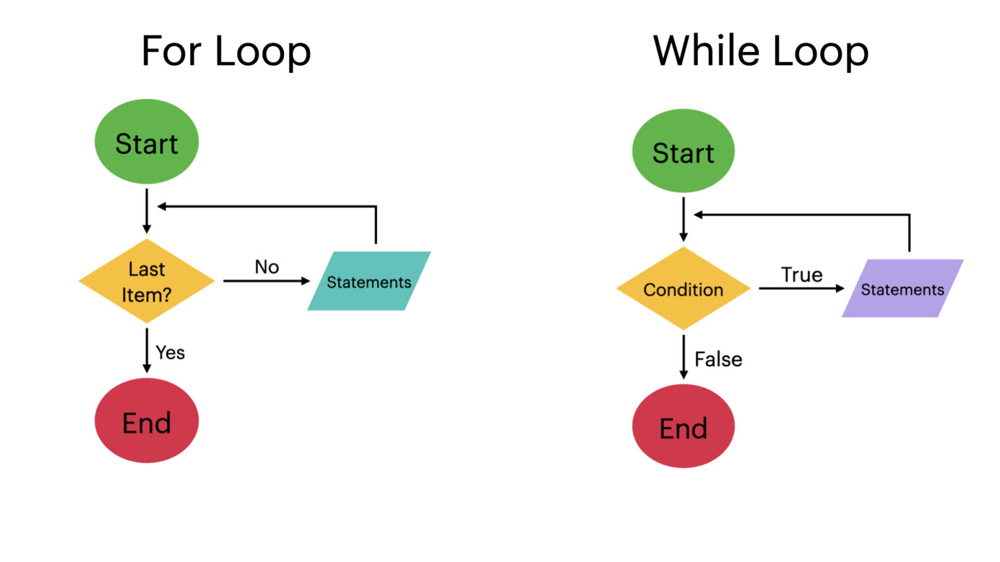

# Flowchart graphs
- Flowchart for if-else
    - [if else flowchart](https://www.zenflowchart.com/guides/if-else-flowchart)
    - 
- Flowchart of for loop & while loop
    - [Flowcharts of Loops](https://www.codingem.com/flowchart-loop/)
    - 

# My own projects
- [flowcharts](https://miro.com/app/board/uXjVLghSrsE=/?share_link_id=878699878928)