# OSM_offline_parser - singpore water
## Tutorial: Processing OSM Data with Python Scripts
### Steps:

### 1. Download the Required `.pbf` File

- Visit [Geofabrik's download site](https://download.geofabrik.de/).
- Navigate to the region you need and download the `.osm.pbf` file.

### 2. Run the OSM Offline Parser

- After downloading, run the following command to process the `.osm.pbf` file. Replace the file path with the location of your downloaded file:

```bash
Example:
python osm_offline_parser.py ./data/input/malaysia-singapore-brunei-latest.osm.pbf 525 1
```

```bash
usage: osm_offline_parser.py [input] [mcc] [hofn_type]

positional arguments:
  input                 Input osm.pbf file path.
  mcc                   mcc
  hofn_type             Process hofn type, Output file name
```

- **Output**: This will generate a `water.tsv` file.

### 3. Locate the Output `water.tsv` File

- The output file will be saved in the following path:

```bash
/home/covmo/test_Ian/osm_offline_parser/data/output/Singapore/water/['536780']/post_processed/water.tsv
```
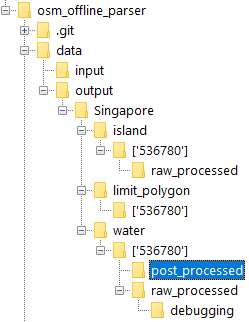

### 4. Manually Move the `water.tsv` File

- Move the `water.tsv` file from the `post_processed` directory to a new location as follows:

```bash
mv /home/covmo/test_Ian/osm_offline_parser/data/output/Singapore/water/['536780']/post_processed/water.tsv /home/covmo/test_Ian/osm_offline_parser/data/output/Singapore/water/
```
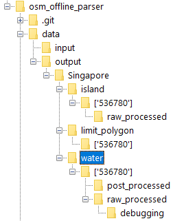
### 5. Run the Geo Polygon Generator

- After moving the `water.tsv` file, execute the following command to generate the polygon files:

```bash
Example:
python geo_polygon_generator.py 525 1
```
```bash
usage: geo_polygon_generator.py [-h] mcc hofn_types

positional arguments:
  mcc         mcc
  hofn_types  format: 'HofnType1 HofnType2' ...
```

- **Output**: This will generate two files: `NT2_GEO_POLYGON.tsv` and `NT2_GEO_POLYGON.csv`.

### 6. Locate the Generated Files

- The files will be saved in the following paths:

```bash
/home/covmo/test_Ian/osm_offline_parser/data/output/Singapore/NT2_GEO_POLYGON.tsv
```

```bash
/home/covmo/test_Ian/osm_offline_parser/data/output/Singapore/NT2_GEO_POLYGON.csv
```
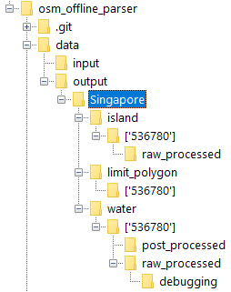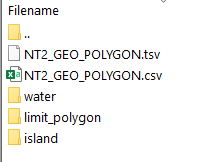  
* output visulization
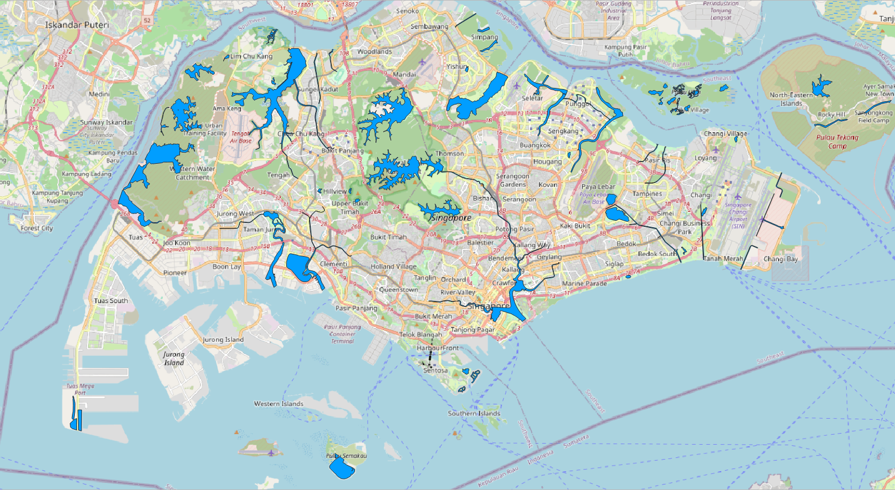

# Project2 - intersection
## Objective: Calculate the land area within each grid and determine how many counties and cities it contains.
* input: county.geojson, self_grid.geojson
    * 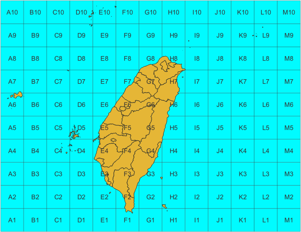
    * 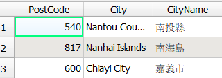 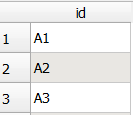
* output: output_pyproj_geojson
    * 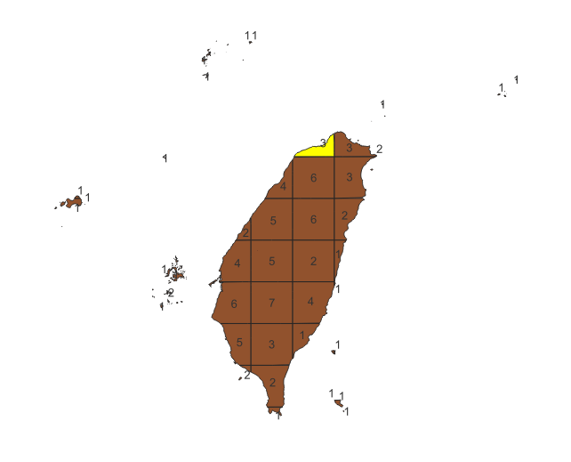
    * 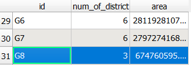

## Problem: Different methods of calculating the area yield different results.
### my method: pyproj

```python
from pyproj import Geod

geod = Geod(ellps="WGS84")

def calculate_area(geom):
    return abs(geod.geometry_area_perimeter(geom)[0])

intersections['area'] = intersections['geometry'].apply(calculate_area)
```
### difference
* The farther the longitude is from the center, the smaller the area; conversely, the closer to the center, the larger the area.
* The farther the latitude is from the center, the smaller the area; conversely, the closer to the center, the larger the area.
* The differences are generally between -0.2% and 0.2%.
* The F6 region has a particularly large difference of 12.43%.
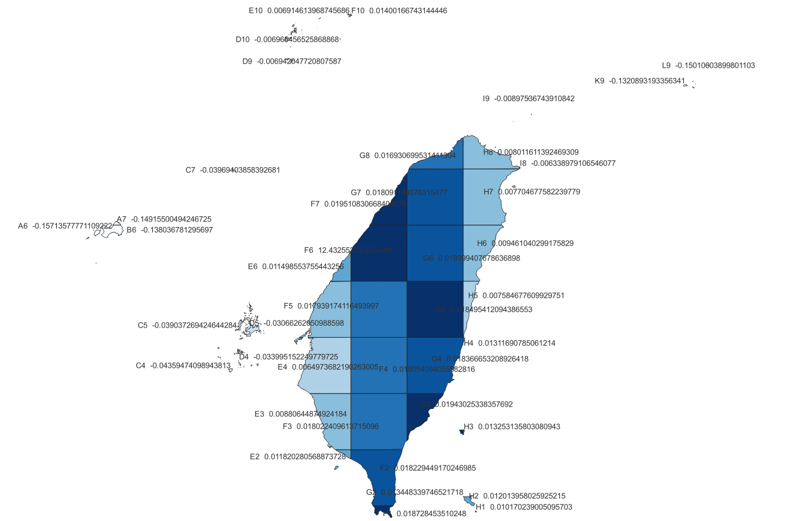
## Procedure: Processing GeoJSON Files and Calculating Intersection Areas

This guide outlines the steps to read GeoJSON files, handle geometries, compute intersections, and calculate areas using Python's GeoPandas and PyProj libraries.

### Step 1: Read GeoJSON Files into GeoDataFrame

- Import the necessary libraries and read the `GeoJSON` files into `GeoDataFrame` objects.

```python
import pandas as pd
import geopandas as gpd
from pyproj import Geod

counties = gpd.read_file('county.geojson')
grid = gpd.read_file('self_grid.geojson')
```

### Step 2: Check for Invalid Geometries and Remove Null Geometries

- Identify any invalid geometries in the datasets and remove rows with `None` geometries.

```python
invalid_counties = counties[~counties.is_valid]
print(invalid_counties)
invalid_grids = grid[~grid.is_valid]
print(invalid_grids)

counties = counties[counties['geometry'].notnull()]
```

### Step 3: Explode MultiPolygons into Single Polygons

- Convert any `MultiPolygon` geometries into individual `Polygon` geometries.

```python
counties = counties.explode().reset_index(drop=True)
```

### Step 4: (Optional) Verify Coordinate Reference Systems

- Check the Coordinate Reference System (CRS) of the GeoDataFrames to ensure they are in `EPSG:4326`.

```python
# print(grid.crs)
# print(counties.crs)
```

### Step 5: Calculate Intersections Between Grid and Counties

- Perform a spatial intersection between the `grid` and `counties` to find overlapping areas.

```python
intersections = gpd.overlay(grid, counties, how='intersection')
```

### Step 6: Calculate the Area of Intersecting Geometries

- Use `pyproj.Geod` to calculate the area of each intersecting geometry. The area is returned in square meters.

```python
geod = Geod(ellps="WGS84")

def calculate_area(geom):
    return abs(geod.geometry_area_perimeter(geom)[0])

intersections['area'] = intersections['geometry'].apply(calculate_area)
```

### Step 7: Group Results by Grid ID and Aggregate

- Group the intersections by grid ID, summing the area and counting the number of unique counties in each grid.

```python
result = intersections.groupby('id').apply(lambda x: pd.Series({
    'num_of_district': x['CityName'].nunique(),
    'area': x['area'].sum(),
    'geometry': x['geometry'].unary_union
})).reset_index()
```

### Step 8: Export the Result to GeoJSON Format

- Set the CRS of the result to `EPSG:4326` and save it as a `GeoJSON` file.

```python
result.set_crs(epsg=4326, inplace=True)
result.to_file('output.geojson', driver='GeoJSON')
```

# overpass 
## Taipei MRT
* The result include datas on new Taipei and Taoyuan
```sql
[out:json][timeout:25];
{{geocodeArea:Taipei}}->.searchArea;
(
  way[route=subway](area.searchArea);
  relation[route=subway](area.searchArea);
);
out body;
>;
out skel qt;
```
```base
out body;
輸出查詢結果的詳細信息。這個指令會顯示所有查詢到的元素的具體數據。

>;
表示查詢所有與結果相關的下層元素。通常用於獲取與路徑和關係相關的節點（node）。

out skel qt;
輸出結果的骨架信息（skeleton）。這樣可以獲取關於節點和路徑的結構化數據，便於後續處理和渲染。

```
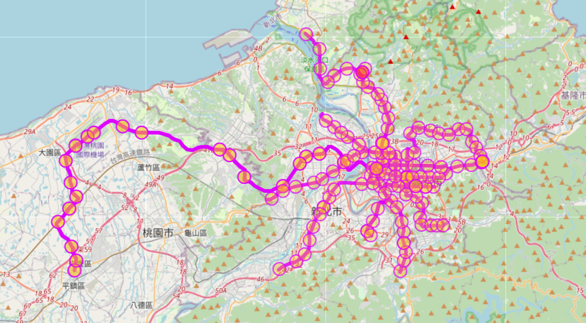

## Taipei + Taichung MRT
* search two region in the same time
```sql
[out:json][timeout:55];
// Fetch areas "Taipei" and "Taichung" to search in
{{geocodeArea:Taipei}}->.taipeiArea;
{{geocodeArea:Taichung}}->.taichungArea;

// Gather results from both areas
(
  way[route=subway](area.taipeiArea);
  way[route=subway](area.taichungArea);
  relation[route=subway](area.taipeiArea);
  relation[route=subway](area.taichungArea);
);

// Print results
out body;
>;
out skel qt;
```
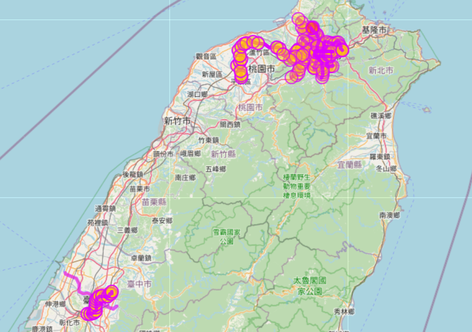
## Taipei MRT Above ground parts
???
* 只有way有layer屬性，realation & node 都沒有
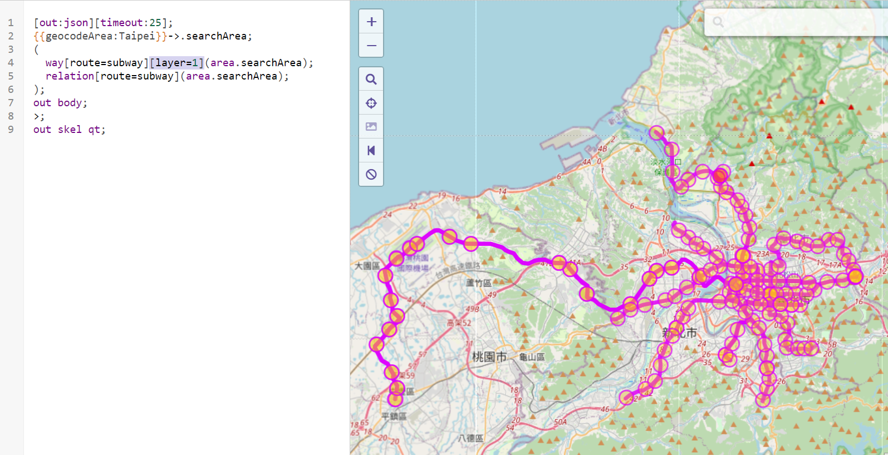
## singapore water
```sql
[out:json][timeout:25];
// Fetch the area of Singapore
{{geocodeArea:Singapore}}->.searchArea;

// Gather results for water bodies within Singapore
(
  way[natural=water](area.searchArea);
  relation[natural=water](area.searchArea);
);

// Print results
out body;
>;
out skel qt;
```
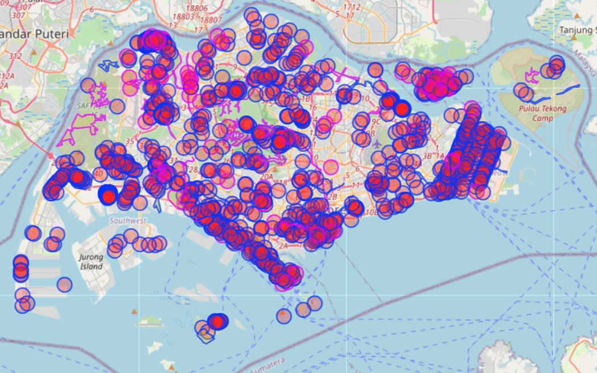

