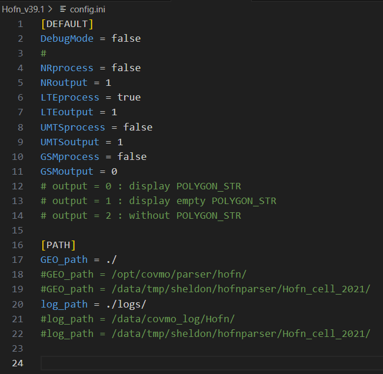
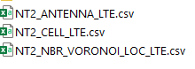
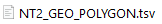
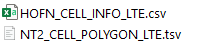
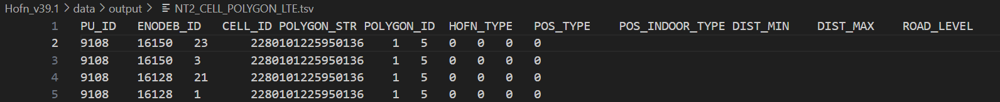
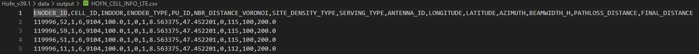
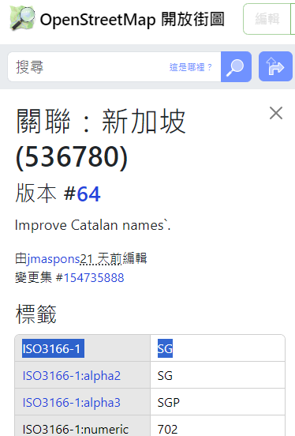
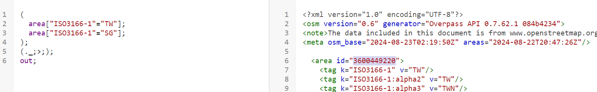
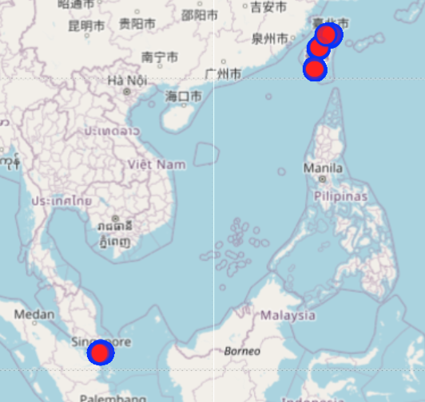
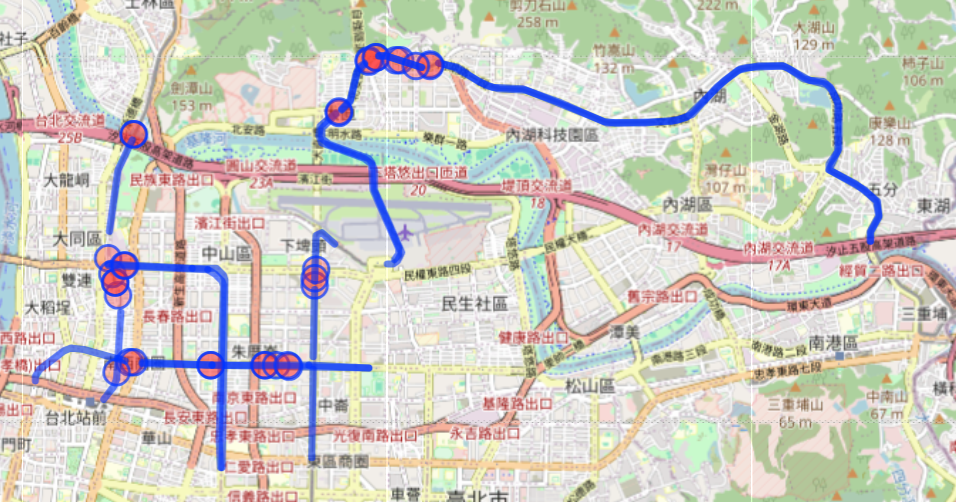

# osm_offline_parser
## 目錄

- [osm_offline_parser.py](#osm_offline_parserpy)
  - [1. READ CONFIG](#1-read-config)
  - [2. PROGRAM ARGUMENTS](#2-program-arguments)
  - [3. Loading program arguments](#3-loading-program-arguments)
  - [4. Log file setting & Log info](#4-log-file-setting--log-info)
  - [5. Data Cutting](#5-data-cutting)
  - [6. Entries](#6-entries)
    - [環狀模式 (rings_mode)](#環狀模式-rings_mode)
    - [線狀模式 (lines_mode)](#線狀模式-lines_mode)
    - [建築模式 (building_mode)](#建築模式-building_mode)
- [線狀模式處理流程 (lines.py)](#線狀模式處理流程-linespy)
  - [is_normal_process](#is_normal_process)
    - [資料獲取](#資料獲取)
    - [線段合併](#線段合併)
      - [線段合併的方法](#線段合併的方法)
    - [特殊處理](#特殊處理)
  - [is_divide_process](#is_divide_process)
    - [1. 函數說明: `process_divide_and_merge`](#1-函數說明-process_divide_and_merge)
    - [1.1 目的](#目的)
    - [1.2 參數](#參數)
    - [1.3 處理流程](#處理流程)
        - [1.3.1 初始化](#初始化)
        - [1.3.2 讀取資料](#讀取資料)
        - [1.3.3 處理分割](#處理分割)
        - [1.3.4 更新合併資料](#更新合併資料)
        - [1.3.5 輸出結果](#輸出結果)
        - [1.4 重要函數](#重要函數)
    - [is_post_process](#is_post_process)
        - [後處理流程](#後處理流程)
        - [輸出](#輸出)

## osm_offline_parser.py

### 1. READ CONFIG
- 讀取配置文件，設置相關參數。

### 2. PROGRAM ARGUMENTS
- 程式參數設置，包括輸入檔案路徑、hofn 類型等。

### 3. Loading program arguments
- 讀取並處理程式參數:
  - **input file path**: 輸入檔案路徑。
  - **hofn type**: 處理的 hofn 類型。
  - **Get nation by mcc**: 根據 mcc 獲取國家。
  - **Limit polygon mode**: 
      - limit_relation_ids: 只做特定relation id的資料
      - use_local_limit_polygon
  - **Divide mode for lines with specified way id**: 海岸線線段分割模式。
  - **Post processing mode**: 只做後處理模式。
  - **Output relation geometry**
  - **Grouping tags**: 設置分組標籤。
  - 使用三個標籤來決定要執行的處理過程:
    ```python
    is_post_process = not is_process_only_output_relation_geometries
    is_divide_process = only_divide_ids is not None and not only_post_processing
    is_normal_process = not only_post_processing and not is_divide_process and not is_process_only_output_relation_geometries
    ```

### 4. Log file setting & Log info

### 5. Data Cutting
- 根據需要僅保留源數據中的特定區域。
- 範例：`malaysia-singapore-brunei-latest.osm.pbf -> processed.osm.pbf (singapore only)`
- 輸出文件路徑：`./osm_offline_parser/data/output/Singapore/limit_polygon/['536780']/processed.osm.pbf`

### 6. Entries
- 根據不同的 `hofn_type` 進入對應模式的處理流程，並根據參數執行對應的數據處理邏輯。

#### 環狀模式 (rings_mode)
**適用範圍**:

- **水域模式 (water)**: HofnType.WATER, `hofn_type = 1`
- **島嶼模式 (island)**: HofnType.ISLAND, `hofn_type = 5`
- **村落模式 (village)**: HofnType.VILLAGE, `hofn_type = 11`

**處理流程**:

- **正常處理 (is_normal_process)**
- **分割處理 (is_divide_process)**
- **後處理 (is_post_process)**

#### 線狀模式 (lines_mode)
**適用範圍**:

- **海岸線模式 (coastline)**: HofnType.COASTLINE, `hofn_type = 2`
- **地下捷運模式 (underground_mrt)**: HofnType.UNDERGROUND_MRT, `hofn_type = 3`
- **隧道模式 (tunnel)**: HofnType.TUNNEL, `hofn_type = 6`
- **高速公路模式 (highway)**: HofnType.HIGHWAY, `hofn_type = 7`
- **航線模式 (ferry)**: HofnType.FERRY, `hofn_type = 10`
- **鐵路模式 (railway)**: HofnType.RAILWAY, `hofn_type = 14`

**處理流程**:
- **正常處理 (is_normal_process)**
- **分割處理 (is_divide_process)**
- **後處理 (is_post_process)**
- 詳細流程在 [線狀模式處理流程 (lines.py)](#線狀模式處理流程-linespy) 中描述。

#### 建築模式 (building_mode)
**適用範圍**:

- **建築模式 (building)**: HofnType.BUILDING, `hofn_type = 9`

**處理流程**:

## 線狀模式處理流程 (lines.py)
  - [is_normal_process](#is_normal_process)
    - [資料獲取](#資料獲取)
    - [線段合併](#線段合併)
      - [線段合併的方法](#線段合併的方法)
    - [特殊處理](#特殊處理)
  - [is_divide_process](#is_divide_process)
    - [1.1 目的](#目的)
    - [1.2 參數](#參數)
    - [1.3 處理流程](#處理流程)
        - [1.3.1 初始化](#初始化)
        - [1.3.2 讀取資料](#讀取資料)
        - [1.3.3 處理分割](#處理分割)
        - [1.3.4 更新合併資料](#更新合併資料)
        - [1.3.5 輸出結果](#輸出結果)
        - [1.4 重要函數](#重要函數)
  - [is_post_process](#is_post_process)
    - [後處理流程](#後處理流程)
    - [輸出](#輸出)  
### is_normal_process

#### 資料獲取
1. **讀取 OSM PBF 文件**
   - 從指定的 `.pbf` 文件中讀取資料。
2. **取出對應tags的每個線段**
2. **存儲資料到 GeoDataFrame 中**
   - 資料被儲存在名為 `lines_df` 的 GeoDataFrame 中。
3. **輸出 unmerged.geojson**
   - 將資料儲存到 `unmerged.geojson` 文件中，路徑為 `f"{output_path}/unmerged.geojson"`。

#### 線段合併
1. **高速公路模式 & 其他模式**
   - **合併方法**: 使用 `utils.py` 中的 `LineUtils.merge_by_intersects()` 方法。
   - **高速公路模式**:
     - 將不同等級的道路分到子 DataFrame 中。
     - 將每個子 DataFrame 中的線段進行合併，然後放入同一個列表中。
   - **其他模式**:
     - 直接進行合併。
##### 線段合併的方法

```python
#src/utils.py
def get_merged_coords(line1_coords: list, line2_coords: list):
    # 檢查兩個線段的順序是否合適合併 line1_coords[-1]：表示第一個線段 line1_coords 的終點座標。 line2_coords[0]：表示第二個線段 line2_coords 的起點座標。
    source, target = (line1_coords, line2_coords) if line1_coords[-1] == line2_coords[0] else (line2_coords, line1_coords) 
    source.pop(-1) # 移除重複點
    source.extend(target) # 將 target 的座標列表添加到 source 之後，形成一個新的合併線段
    return source
```

#### 特殊處理
1. **將字串轉換為幾何對象**
   - 使用 `wkt.loads(geometry)` 方法將字串轉換為幾何對象。
2. **航線的特殊處理**
   - 當 `HofnType` 為 `ferry` 時，生成一個 15 米的緩衝區。
- 將資料儲存到 `merged.geojson` 文件中，路徑為 `f"{output_path}/merged.geojson"`。

#### 輸出
1. **輸出路徑**
   - 正常處理輸出路徑: `raw_processed_output_path = output_path + "/raw_processed"`


### is_divide_process
### 目的
此函數用於處理和合併地理資料，並針對指定的多邊形 ID 進行分割。

### 處理流程

1. **初始化**
   - 設定合併和未合併資料的檔案路徑。
   - 設定輸出路徑並創建目錄（如果尚不存在）。`output_path = f"{data_path}/divided"`

2. **讀取資料**
   - 從指定路徑讀取合併資料 (`merged_file`) 和未合併資料 (`unmerged_file`)。

3. **處理分割**
   - 根據設定的分割長度閾值（預設為 100 公里）進行分割操作。
   - 對每個需要分割的多邊形 ID:
     - 從合併資料中提取對應的幾何形狀。
     - 查找與未合併資料相交的幾何形狀。
     - 移除不需要分割的冗餘幾何形狀。
     - 將長幾何形狀分割為多個段。
   
4. **更新合併資料**
   - 從合併資料中移除已分割的多邊形 ID。

5. **輸出結果**
   - 將分割結果和更新後的合併資料分別輸出為檔案。

### 重要函數
- **`read_data(file_path)`**: 讀取指定路徑的資料。
- **`get_geometry_length_in_km(geometry)`**: 計算幾何形狀的長度（以公里為單位）。
- **`LimitAreaUtils.get_intersects_dataframe(unmerged, geometry_wkt)`**: 查找與給定幾何形狀相交的資料。
- **`LineUtils.get_sequential_merged_line(dataframe, threshold)`**: 根據指定的閾值合併相交的線段。
- **`output_data(file_name, data)`**: 輸出處理結果為檔案。


### is_post_process

#### 後處理流程
1. **地下捷運需額外提供原始 input**
2. **有無分割 ID 的處理**
   - **無分割 ID**:
        - 將不同模式進行後處理，依據具體 `mode` 執行：
            - **高速公路模式 (HofnType.HIGHWAY)**
            - **海岸線模式 (HofnType.COASTLINE)**
            - **地下捷運模式 (HofnType.UNDERGROUND_MRT)**
            - **其他模式**
   - **有分割 ID** (僅限於海岸線模式):
     - 進行分割處理，並輸出分割後的資料。

#### 輸出
1. **輸出路徑**
   - 後處理輸出路徑: `post_processed_output_path = output_path + "/post_processed"`

2. **特殊處理輸出**
   - 對於海岸線模式 (`coastline`)，會輸出兩個檔案：
     - `divided_post_processed_data`
     - 合併後的 `concat([normal_post_processed_data, divided_post_processed_data])`


# run Hofn.py

## Main Programs
- `Hofn.py`
- `file_IO.py`
- `poly_process_cell.py`
- `config.ini`
  - 

## Command to Run
```bash
python3 Hofn.py [Hilo_output path] [Hofn path]
```
Example:
```bash
python Hofn.py ./data/input/ ./data/output/
```

## Input Files
- **Path:** `/home/covmo/test_Ian/Hofn_v39.1/data/input`

  

- **Path:** `/home/covmo/test_Ian/Hofn_v39.1`

  

## Output Files
- path: `/home/covmo/test_Ian/Hofn_v39.1/data/output`

   
   
   
   
   
   

# overpass
## 用overpass同時顯示出台灣跟新加坡的地鐵
1. 從Open stree map查詢ISO3166-1代碼

      

2. 查詢台灣&新加坡的area id
      ```sql
      (
        area["ISO3166-1"="TW"];
        area["ISO3166-1"="SG"];
      );
      (._;>;);
      out; 
      ```

      
      [reference](https://gis.stackexchange.com/questions/178424/overpass-turbo-area-code-lookup)

3. 利用area id 框出範圍(台灣+新加坡)
      ```sql
      area(3600449220)->.taiwanArea;
      area(3600536780)->.singaporeArea;
      (.taiwanArea; .singaporeArea;)->.combinedArea;

      (
        way[railway=subway](area.combinedArea);
      );
      out body;
      >;
      out skel qt;
      ```

      

- area id 要補滿十位數
- 36 + [0*n] + relation id

## 查詢中山區捷運
  ```sql
  area(3602822029)->.zhongshanArea;
  (
    way[railway=subway](area.zhongshanArea);
  );
  out body;
  >;
  out skel qt;
  ```

  