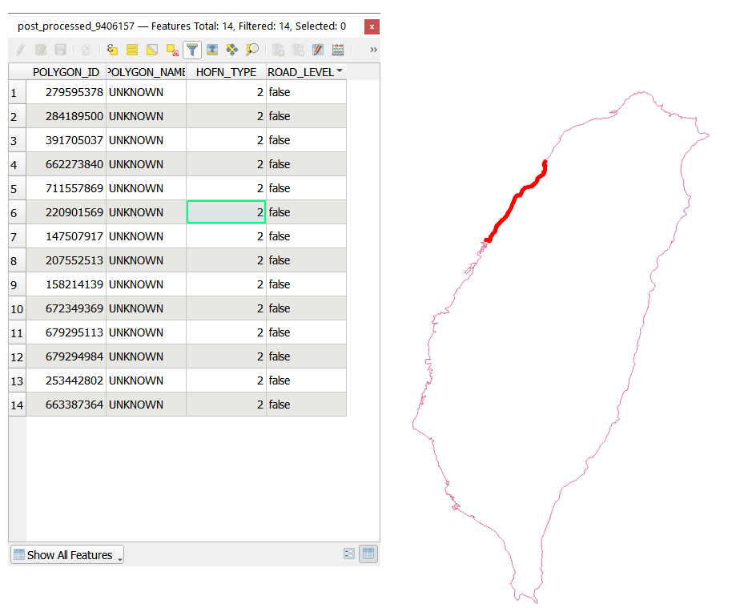
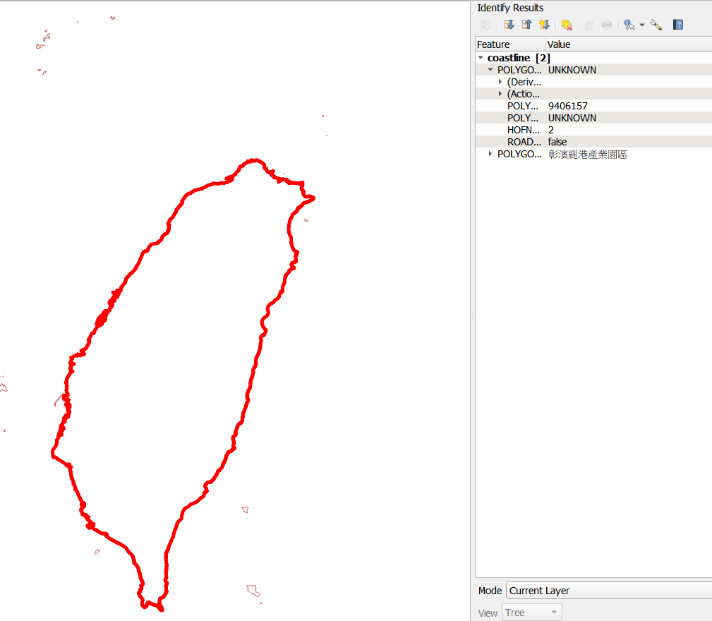
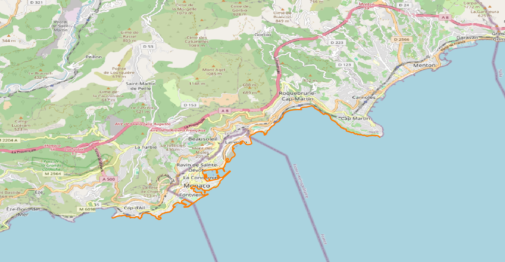
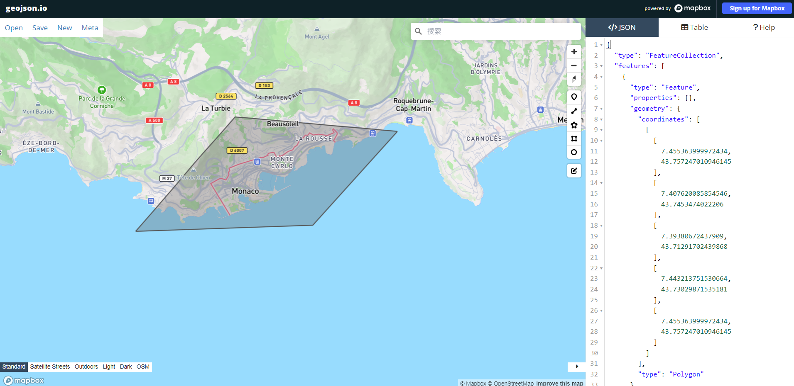
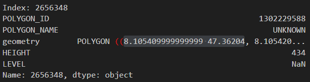
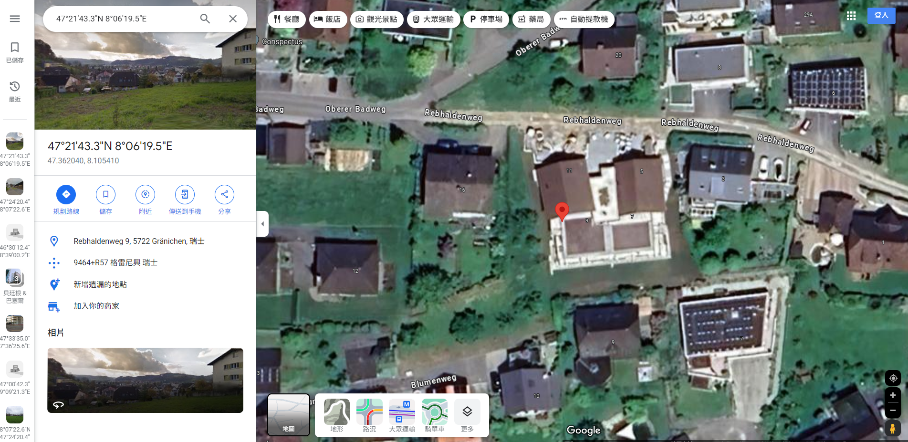

# Taiwan coastline divide
- input
    - `taiwan-latest.osm.pbf`
- output
    - `post_processed_9406157.tsv`

    - 
## procedure
1. `python osm_offline_parser.py ./data/input/taiwan-latest.osm.pbf 466 2`
2. search taiwan main island relation id using QGIS

    - 
3. `python osm_offline_parser.py ./data/input/taiwan-latest.osm.pbf 466 2 -d 9406157`
4. generated file's path & name: `./data/output/Taiwan/coastline/['449220']/post_processed/post_processed_9406157.tsv`

# Monaco coastline extend
- input:
    - `provence-alpes-cote-d-azur-latest.osm.pbf`
- output:

    

1. draw a handmade polygon
    - [link](https://geojson.io/#new&map=2/0/20)
    - output: map.geojson
    - 
2. put in right directory
    - locate .geojson in path: `./data/output/Monaco/limit_polygon/custom`
    - name as: `limit_polygon.geojson`
3. add Monaco's information into `config.yaml & attributes.py`
    ```python
    # attributes.py line 85
    Monaco = country_config.get("Monaco").get("mcc"), country_config.get("Monaco").get("relation")    
    ```
    ```yaml
    # config.yaml line 129
    Monaco:
    mcc: "212"
    relation: "1124039"
    ```    
4. execute program using command `python osm_offline_parser.py ./data/input/provence-alpes-cote-d-azur-latest.osm.pbf 212 2 -locli`
5. output 
    - path: `./data/output/Monaco/coastline/custom/post_processed`
    - file name: `coastline.tsv`
# Switzerland building preprocessing
1. data cleaning
- split all situation into fout catagarize
    
    - height | level
    1. yes      yes
    2. yes      nan(包含於1)
    3. nan      yes
    4. nan      nan(不處理)

    - 1, 2 一起處理
    - 3: 將level * 3做為height
    - 4: 不處理

- deal with not reasonable height(situation 1 & 2)
    - print out all height > 200
    - check manullaly

        
        
    - input relation_ids to fix height
        - if level != Nan height = level * 3
        - if level == Nan height = Nan
    - fill in 'height' == Nan by 'level' * 3
2. merge intersect building

    - note
        - https://pygeos.readthedocs.io/en/latest/predicates.html
            - intersects(a, b, **kwargs)
            - Returns True if A and B share any portion of space.
            - Intersects implies that overlaps, touches and within are True.
