# #80743 [Airtel]- Create/modify country boundary for dim_mcc.
- Goal: modify boundry for dim_mcc.tsv
- procedure:
    1. Create a Python program to extract the required countries' geometry.

        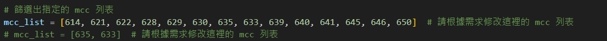
        
        | Input File `dim_mcc.tsv`| Output File `output.geojson`|
        |------------------------|------------------------|
        | 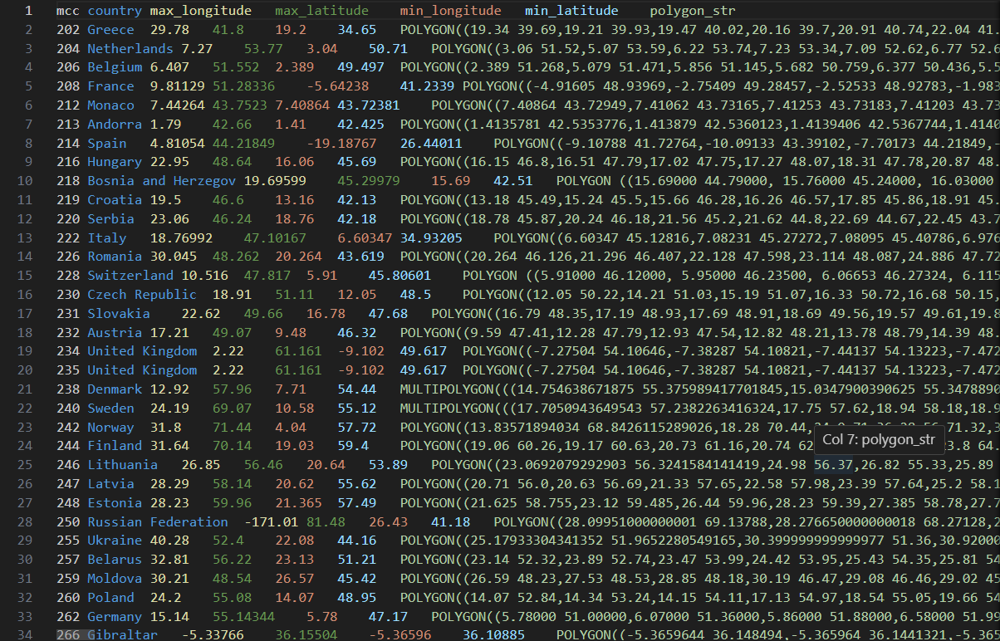  | 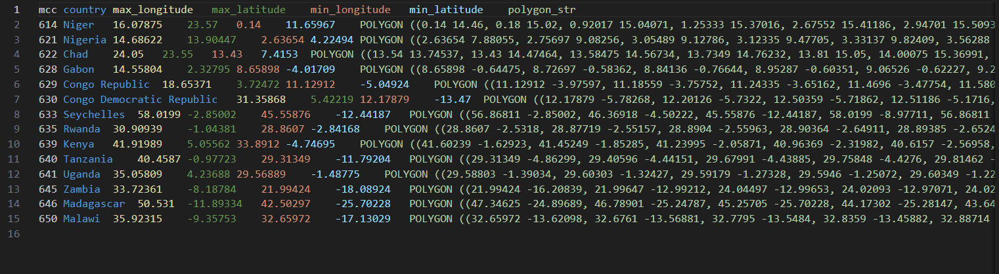 |

    2. open file `output.geojson` in : [geojson.io](https://geojson.io/#map=2/0/20) and modify the boundary
        - Save as geojson file  `map.geojson` when finished

        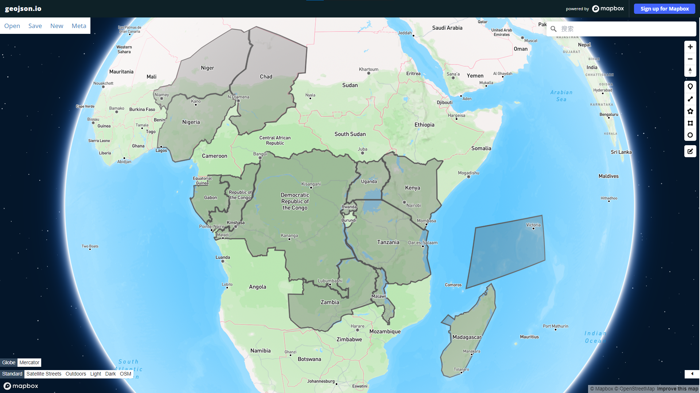
        

    3. use python program to calculate min_lng, min_lat, max_lng, max_lat and update to `dim_mcc.tsv`

    4. check string in [Wicket](https://arthur-e.github.io/Wicket/sandbox-gmaps3.html)
        - Since base map of `geojson.io` is OSM, but it also need to match to google map's boundary. 

    5. push to gitlab
        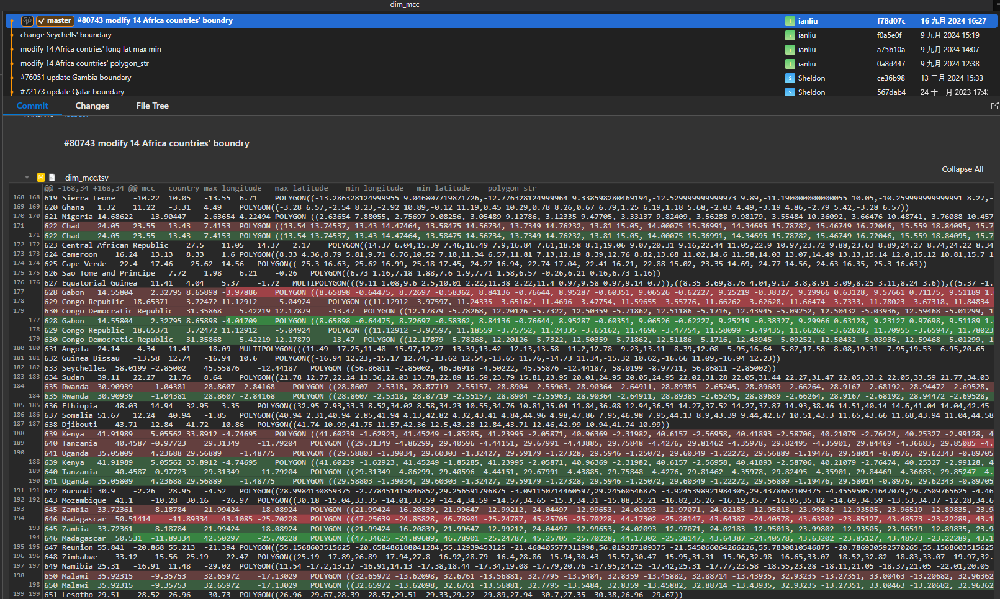

# #80806 [STC] - Split Ericsson Pus & reorder polygon_name.
## split pu evenly
1. create a python program to calculate every site's longitude & latitude
    - input: `NT2_ANTENNA_{TECH}` `NT2_CELL_{TECH}` `ORIGIONAL SITE INFO`
    - output: 
        
        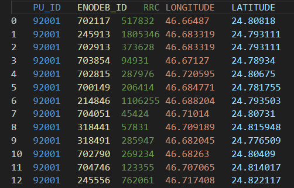
    - indicate lng & lat for every site of same enodeb_id by mode
        ```python
        def calculate_mode(series):
            mode_result = stats.mode(series, nan_policy='omit')
            return mode_result.mode
        ```
2. QGIS split PUs

    |input|output|
    |------------|-----------|
    |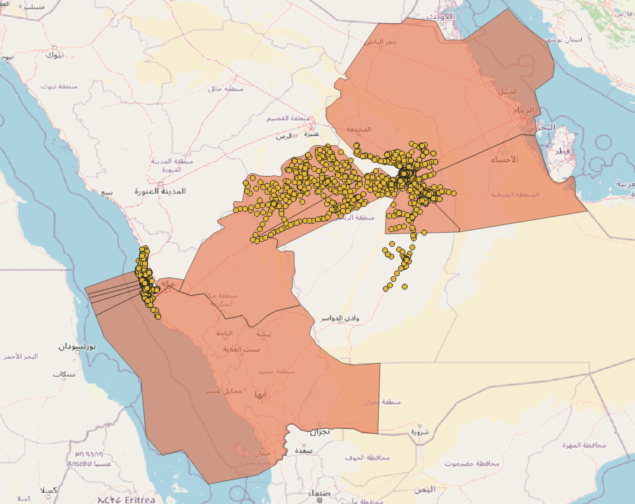|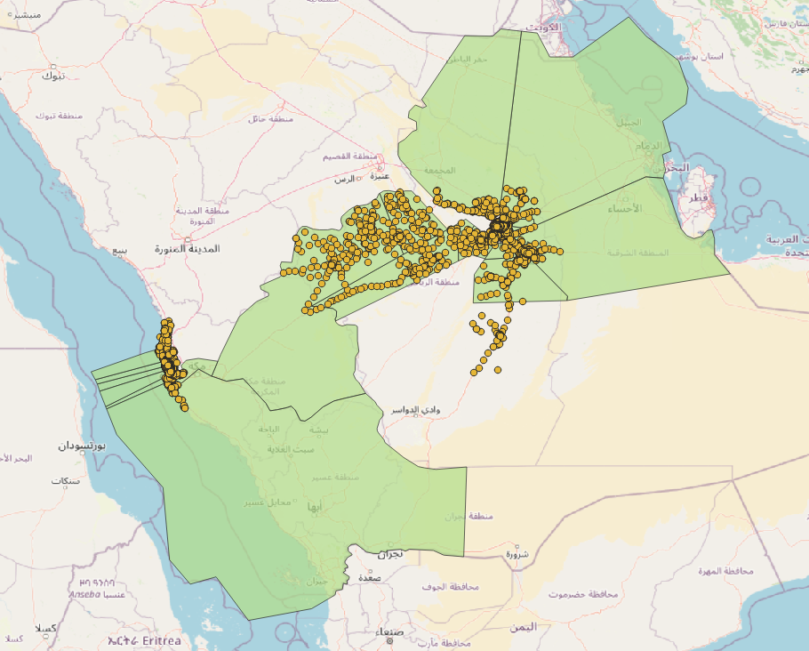|
    |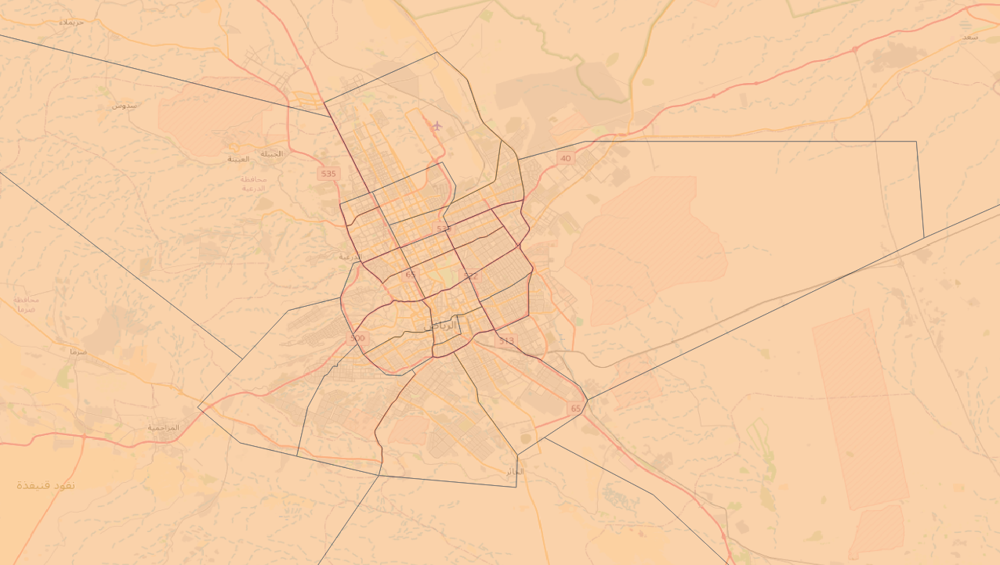|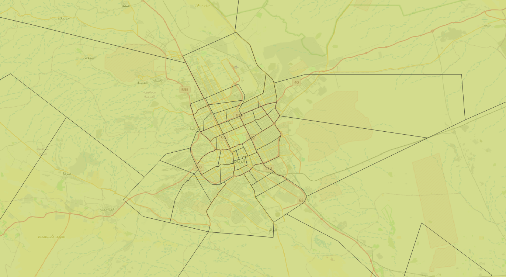|
    
    - python program to check weather split equaily

        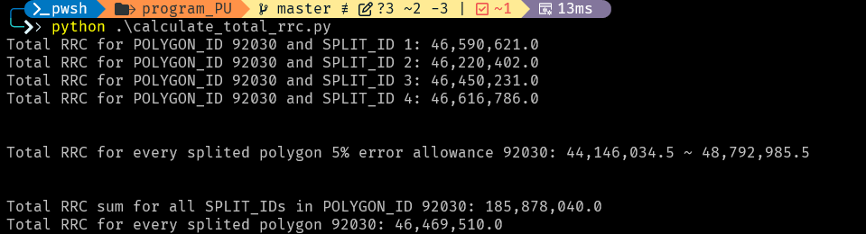


3. python program to replace old PU polygon into splited polygon

## rename PUs POLYGON_NAME
e.g. `Central_Riyadh_1_1_E` -> `Central_Riyadh_1_E`
|input| output|
|---------|-------|
|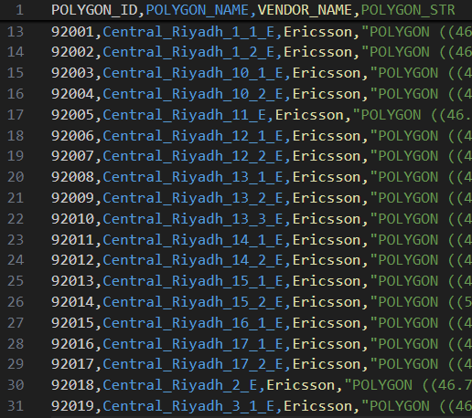|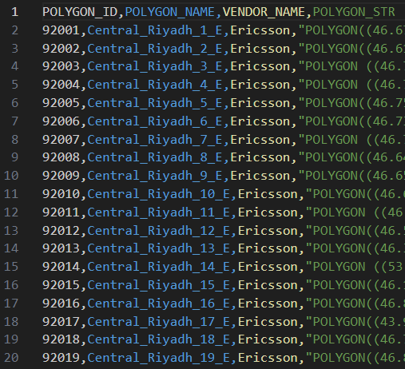|


# #79379 [degrees] - Prepare GIS and Hofn module for 2degrees (New Zealand)
## NT2_GEO_POLYGON
0. add New Zealand information into python code
    * `./resource/config.yaml`line 132 add NewZealand

        ``` python
        NewZealand:
        mcc: "530"
        relation: "556706"
        ```
    * `./src/attributes.py` line 86 add NewZeland
        ``` python
        NewZealand = country_config.get("NewZealand").get("mcc"), country_config.get("NewZealand").get("relation")    
        ```
1. generate highway.tsv (Road level 1-5)
    * `./resource/config.yaml`line 17 adjust target road level
        ```python
        highway:
            highway: [ motorway, trunk, primary, secondary, tertiary ] #1-5
        ```
    
2. generate water.tsv 

3. (in progress) generate coaastline.tsv:
    - need to filter unnessery coastline since there are too many small island

        
4. (in progress)(output files 1+2+3) merge `highway.tsv`, `coastline.tsv` and `water.tsv`
    
## (in progress)PU_building
1. calculate building area interval
    
    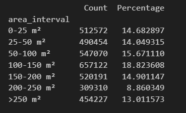

2. buffer buildings
3. merge buildings

