# #79379 Prepare GIS and Hofn module for 2degrees (New Zealand)
## PU_building
0. step 1+2+3: run `PU_building.py` in vscode by jupygter
1. calculate building area interval

    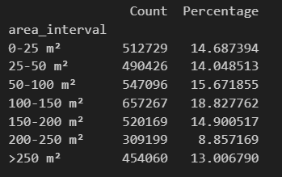
    - PCS V.S. GCS

        | | PCS | GCS |
        |---|---|---|
        |cost time| 20 seconds | 5 mins 20 seconds |
        |adaptability| low | high |
        |screen shot| 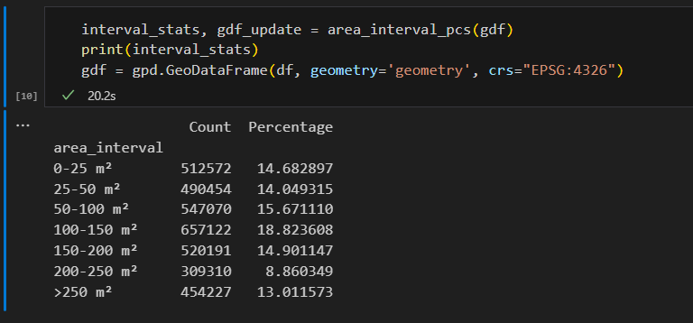 | 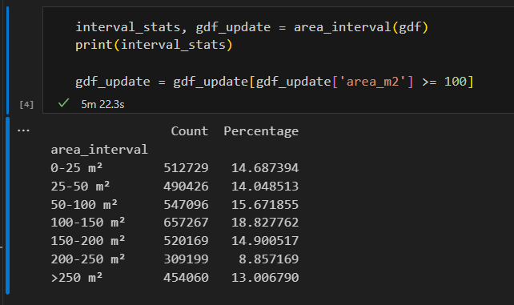 |
        |method||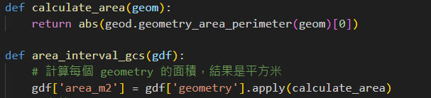|


2. buffer & filter & merge
    - to select indicated area for visolization, run `select_area.py`
    - building count: 3490946 -> 524758(keep only 15%)

    | area | Raw Data | Buffer (10 meter) + Filter (100 m²) | Merged |
    | ------|----------|--------------------------------------|--------|
    | urben area(wellington) |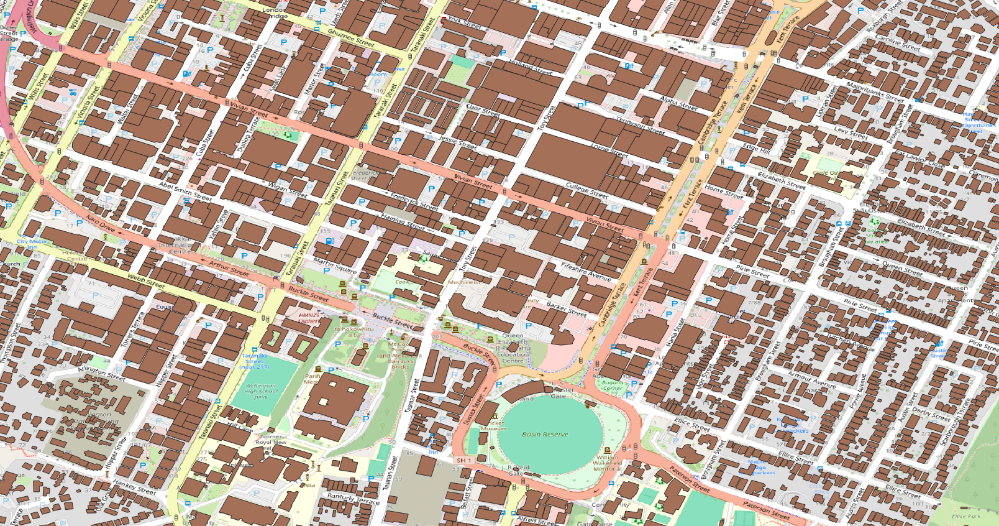 |  |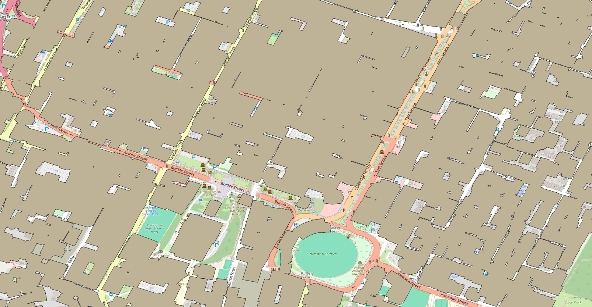  |
    | rural area | 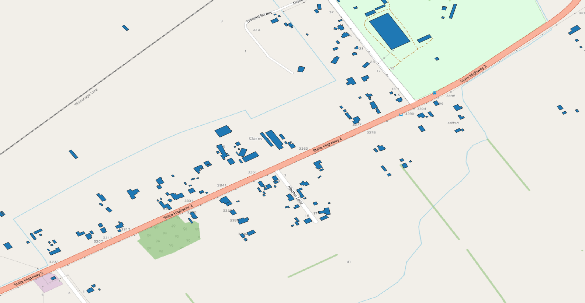|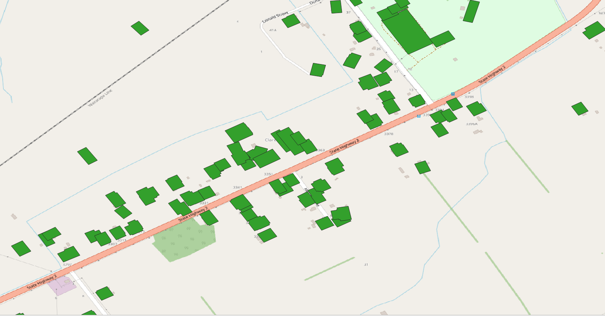|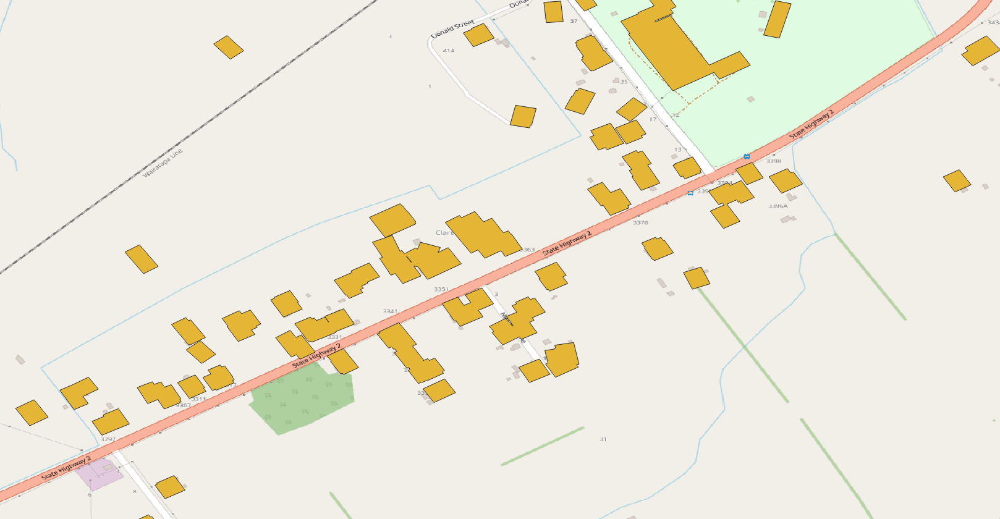|

    references :   
    [GeoSeries.buffer documentation](https://geopandas.org/en/stable/docs/reference/api/geopandas.GeoSeries.buffer.html)  
    [GeoSeries.unary_union documentation](https://geopandas.org/en/v0.10.0/docs/reference/api/geopandas.GeoSeries.unary_union.html)


3. fill in holes

    - count holes distribution

        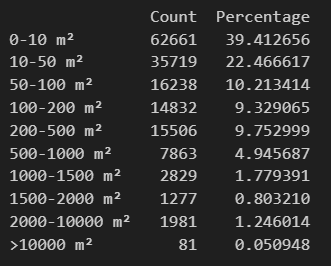

    | Before | After |
    |------|-----|
    |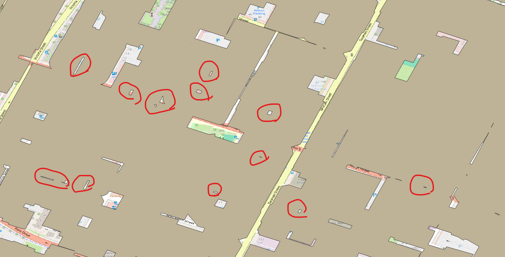 |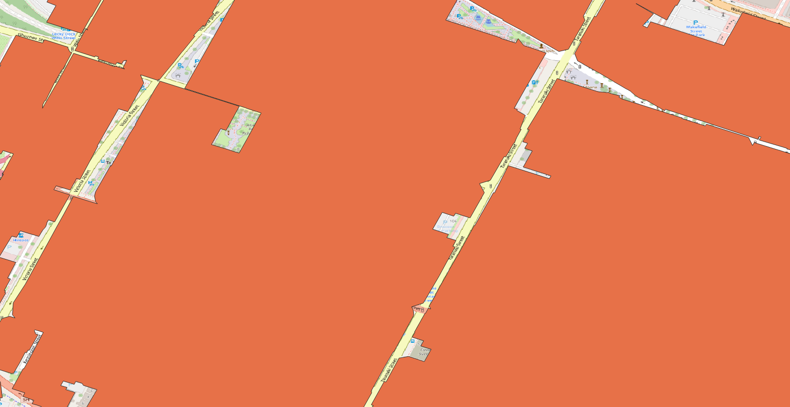|

# 81019 New 3D building for Telkomsel
- Check:
    1. All geometries are valid
	    - some buildings are invalid -> validize by convert to multipolygon, split to polygons, reassign polygon_id
    2. All geometries type are Polygon 
	    - split to polygons, reassign polygon_id
    3. All `Polygon_ID` are unique
    4. No Null value 
	    - A building with null value in column `POLYGON_ID` is assigned as `103063173000010`
    5. (`AGL` & `AMSL` & `Building_max_AGL`) != 0
    6. datatype

- new columns:
    - `Building_ID` and `Building_Name`: If two building intersect, their `building_ID` should be the same. Use highest building's `Polygon_name` as the ` Building_ID` and `Building_name` for the group(intersect buildings).
    - `Polygon_Centroid`: Assign each polygon's centroid.
    - `Building_max_AGL`: Assign the hightest building's `AGL` for the entire group(intersect buildings).

| Columns required| New File's Columns| Columns to Keep in new file| New Columns to Add in new file|
|-----------------------|-----------------------------|----------------------------------|----------------------------------------|
| WKT                   | Polygon_ID                  | Polygon_ID                      | Building_ID                           |
| Polygon_ID            | class                       | AGL                             | Building_Name                         |
| AGL                   | AGL                         | AMSL                            | Polygon_Centroid                      |
| AMSL                  | AMSL                        | geometry                        | Building_max_AGL                      |
| Building_ID           | Longitude                   |                                  |                                        |
| Building_Name         | Latitude                    |                                  |                                        |
| Polygon_Centroid      | geometry                    |                                  |                                        |
| Building_max_AGL      |                             |                                  |                                        |

|old data|new data|
|------|------|
|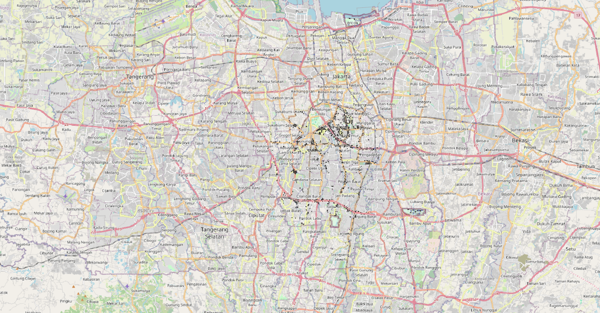|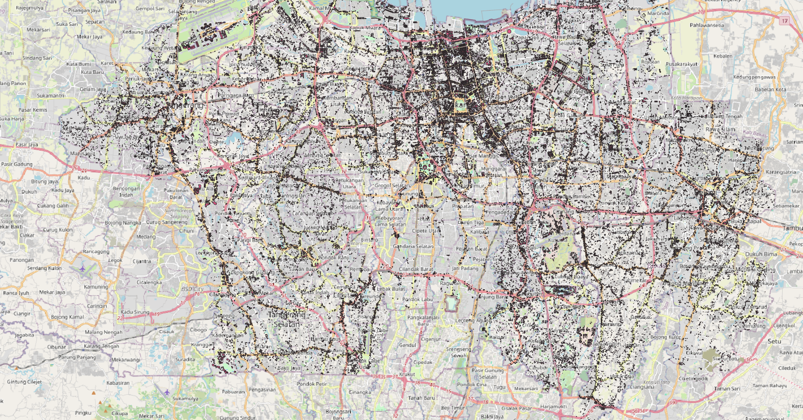|

**validation**

``` python

#%% 1. Check each column's datatype and print a message if it doesn't match the expected type
print('Step1: Checking for datatype...')
expected_dtypes = {
    'WKT': 'geometry',
    'Polygon_ID': 'int64',
    'AGL': 'float64',
    'AMSL': 'float64',
    'Building_ID': 'int64',
    'Building_Name': 'int64',
    'Polygon_Centroid': 'object',
    'Building_max_AGL': 'float64'
}
all_correct = True
for column, expected_dtype in expected_dtypes.items():
    actual_dtype = str(gdf.dtypes.get(column, None))  # Get the actual dtype or None if the column is missing
    if actual_dtype != expected_dtype:
        print(f"Column '{column}' has datatype '{actual_dtype}', expected '{expected_dtype}'.")
        all_correct = False
if all_correct:
    print('\nAll datatypes are correct.')

#%% 2. Ensure there are no null values in `Polygon_ID`
print("Step 2: Checking for null values in `Polygon_ID`...")
null_polygon_ids = gdf[gdf['Polygon_ID'].isnull()]
if len(null_polygon_ids) > 0:
    print(f"Found {len(null_polygon_ids)} rows with null `Polygon_ID` values.")
else:
    print('\nNo null value')

#%% 3. Ensure (`AGL`, `AMSL`, `Building_max_AGL`) != 0
print("Step 3: Checking for zero values in `AGL`, `AMSL`, or `Building_max_AGL`...")
zero_values = gdf[(gdf['AGL'] == 0) | (gdf['AMSL'] == 0) | (gdf['Building_max_AGL'] == 0)]
if len(zero_values) > 0:
    print(f"Found {len(zero_values)} rows with `AGL`, `AMSL`, or `Building_max_AGL` equal to 0.")
else:
    print('No 0 in AGL, AMSL and Building_max_AGL')    

#%% 4. Ensure all `Polygon_ID` are unique
print("Step 4: Checking for duplicate Polygon_IDs...")
duplicate_polygon_ids = gdf[gdf.duplicated(subset='Polygon_ID', keep=False)]
if len(duplicate_polygon_ids) > 0:
    print(f"Found {len(duplicate_polygon_ids)} duplicate `Polygon_ID`s.")
else:
    print('\nNo duplicate Polygon_IDs')

#%% 5. Ensure all geometries are valid
print("Step 5: Checking for invalid geometries...")
gdf['is_valid'] = gdf['WKT'].is_valid
invalid_geometries = gdf[~gdf['is_valid']]
if len(invalid_geometries) > 0:
    print(f"Found {len(invalid_geometries)} invalid geometries.")
else:
    print("\nAll geomatries are valid")

#%% 6. Ensure all geometries are of Polygon type
print("Step 6: Checking for non-Polygon geometries...")
gdf['geom_type'] = gdf['WKT'].geom_type
non_polygon_geometries = gdf[gdf['geom_type'] != 'Polygon']
if len(non_polygon_geometries) > 0:
    print(f"Found {len(non_polygon_geometries)} geometries that are not of type Polygon.")
else:
    print('\nAll geometries are Polygon type')

print("\nValidation completed.")    
```