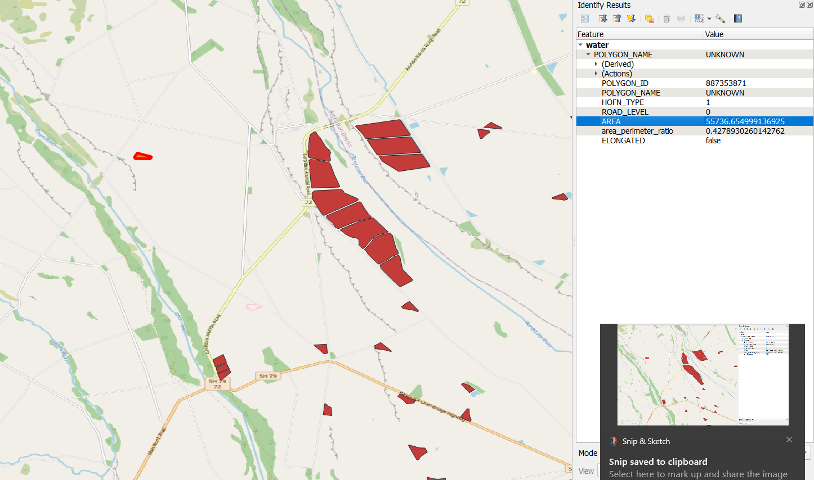
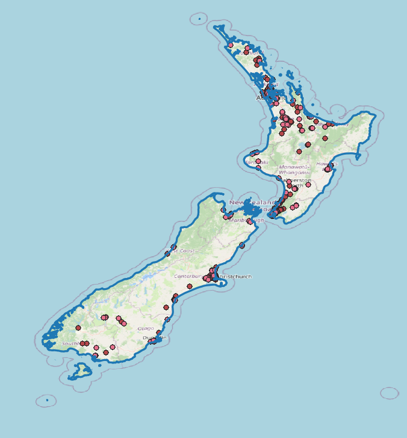
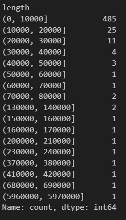
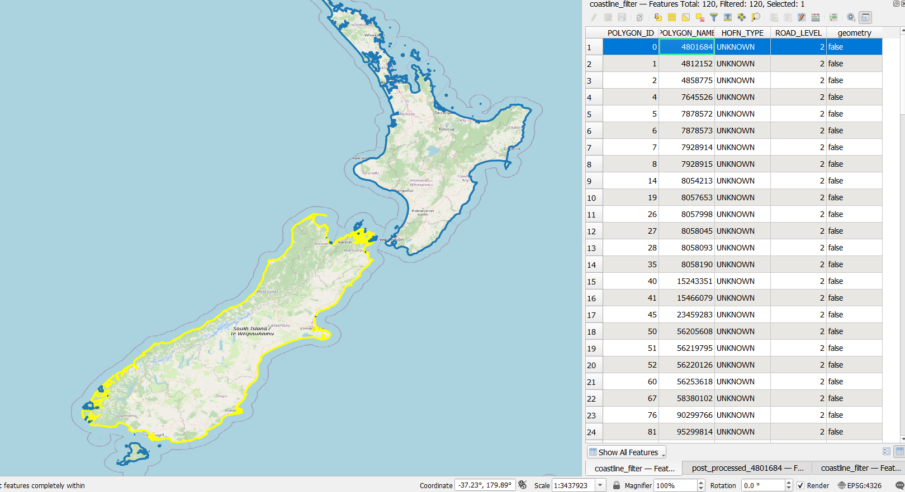
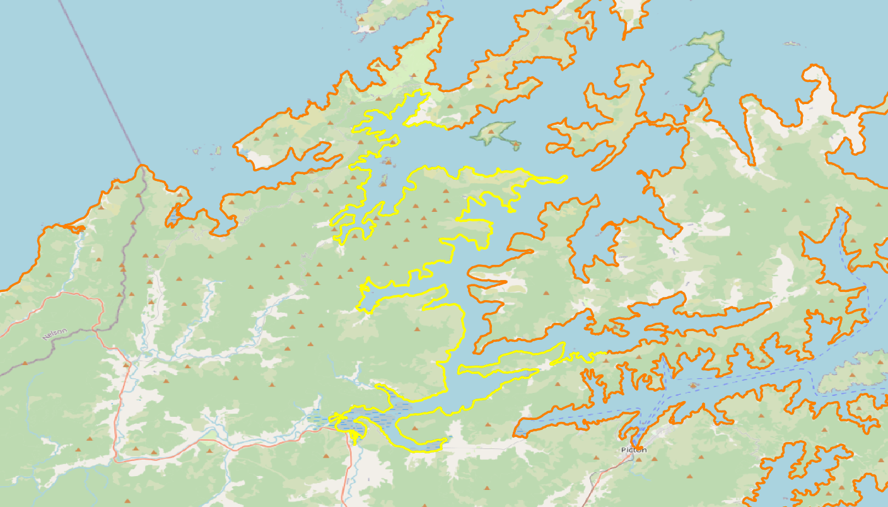
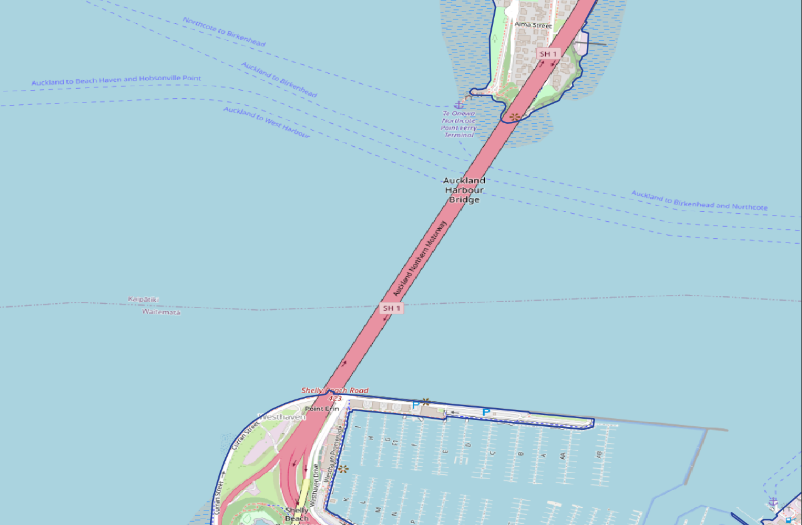
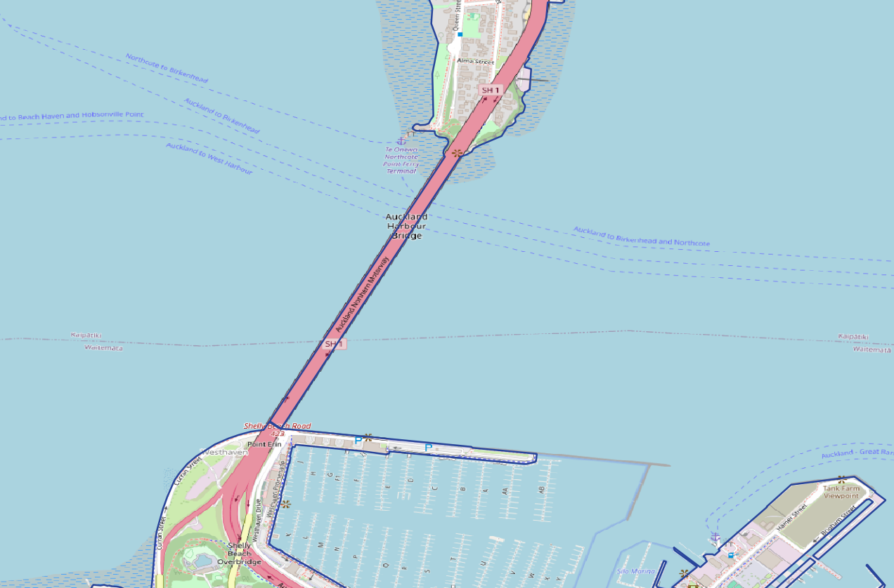
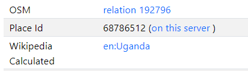
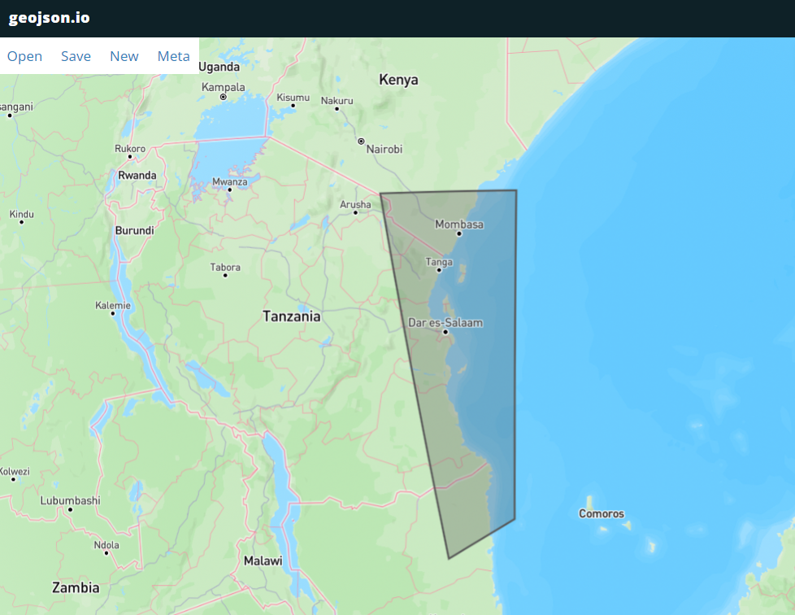
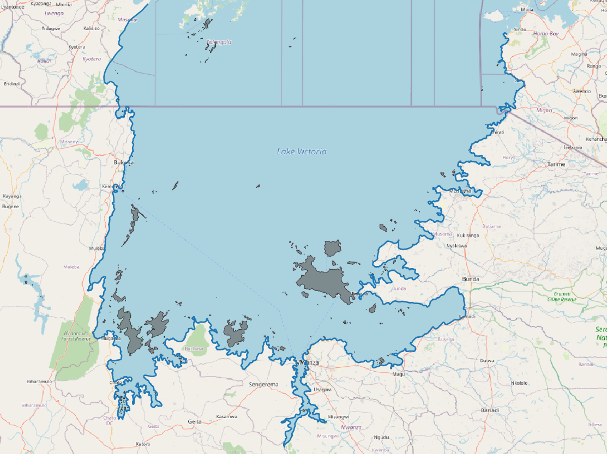

# 79379 Prepare GIS and Hofn module for 2degrees (New Zealand)
## NT2_GEO_POLYGON_newzealand

- 1Water, 2Coastline, 7Highway

**readme**
- Hofn_type 1(Water):
	- filter: keep water bodies with an area > 70000(m^2)
	- filter: keep water bodies with area_perimeter_ratio > 0.1

- Hofn_type 2(coastline):
	- The two main islands(north island & south island) are seperated by 300(Km)
	- filter: keep costlines with a length > 5000(meters)
	- manually modify coastlines on the cross-ocean bridge 

- Hofn_type 7(highway): 
	- Road level 1-5

**procedure**

1. add New Zealand information into `OSM_offline_parser`
    * `./resource/config.yaml` line 132 add NewZealand

        ``` python
        NewZealand:
        mcc: "530"
        relation: "556706"
        ```
    * `./src/attributes.py` line 86 add NewZeland
        ``` python
        NewZealand = country_config.get("NewZealand").get("mcc"), country_config.get("NewZealand").get("relation")    
        ```
1. Road 1-5
  
2. Water 
    - filter (3195 rows -> 1534 rows)
        - drop area < 70000(m^2)
            <!--  -->
            - 

        - drop area_perimeter_ratio < 0.1

3. Coastline: 
    - find NT2_antenna_[tech] file to determine which coastline is necessery to keep
        - all cells are include in two main land

            <!--  -->
            

    - filter: keep costlines with a length > 5000 (meter)
        - coastline length distribution
            <!-- -  -->
            - 
        - 543 coastlines-> 120 coastlines

    - cut north island & south island coastline in threashole = 300 (Km)

        |Relation id|300m|
        |----------|----------|
        |||

        - 120 coastlines -> 171 coastlines
    
    - manually adjust cross oction bridge
        | before                          |after                          |
        |-----------------------------------|-----------------------------------|
        |           |           |

4. Concat `highway.tsv`, `coastline.tsv` and `water.tsv`

6. **Validation**

    
    <!--  -->


# 81068 Africa 14 countries GIS landusage
## Add 14 countries' information into program

- `./resource/config.yaml`
    - find relation
        - link: https://nominatim.openstreetmap.org/ui/search.html
        - 

    ``` python
    Tanzania:
        mcc: "640"
        relation: "195270"
    Uganda:
        mcc: "641"
        relation: "192796"
    Nigeria:
        mcc: "621"
        relation: "192787"
    etc...
    ```
    
- `./src/attributes.py`
    ``` python
    Tanzania = country_config.get("Tanzania").get("mcc"), country_config.get("Tanzania").get("relation")    
    Uganda = country_config.get("Uganda").get("mcc"), country_config.get("Uganda").get("relation")    
    Nigeria = country_config.get("Nigeria").get("mcc"), country_config.get("Nigeria").get("relation")    
    etc...
    ```
## TZ (Tanzania)
### NT2_GEO_POLYGON_Tanzania
- 1 water, 2 coast line, 7 highway, 11 village
- 1 water
- (in prograss) 2 coastline
    - draw an area manually in https://geojson.io/#map=2/0/20
        - locate .geojson in path: `./data/output/Tanzania/limit_polygon/custom`
        - name as: `limit_polygon.geojson`
        <!-- -  -->
        - 

    1. coastline
        - download whole Africa data `africa-lastest.osm.pbf`
        - command: `python osm_offline_parser.py ./data/input/{}.osm.pbf 640 2 -locli`

    2. 3 areas at lack in the country boundry
        - command: `python osm_offline_parser.py ./data/input/tanzania-latest.osm.osm.pbf 640 1 -relation 2606941 -locli`
            - `./data/output/Tanzania/water/custom/raw_processed/water_relation_[2606941].tsv`
            - `./data/output/Tanzania/water/custom/raw_processed/island.tsv`
            <!--  -->
            - 

- 7 highway
- 11 village