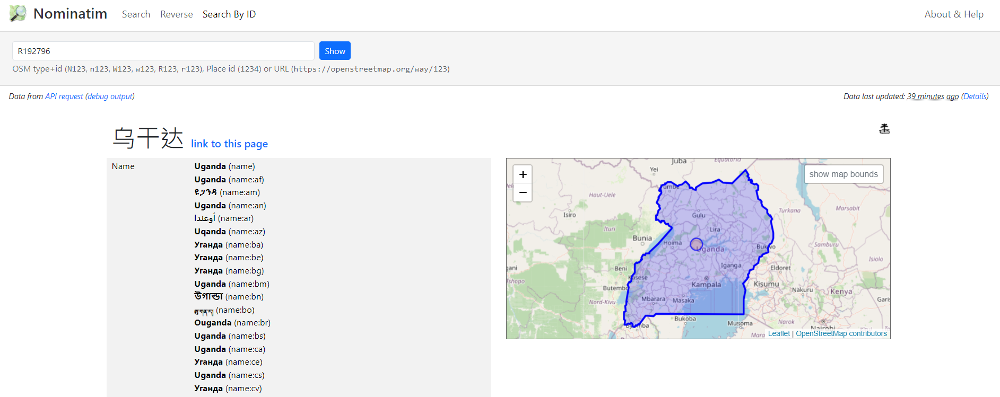
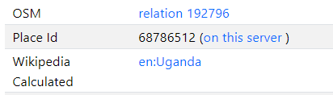
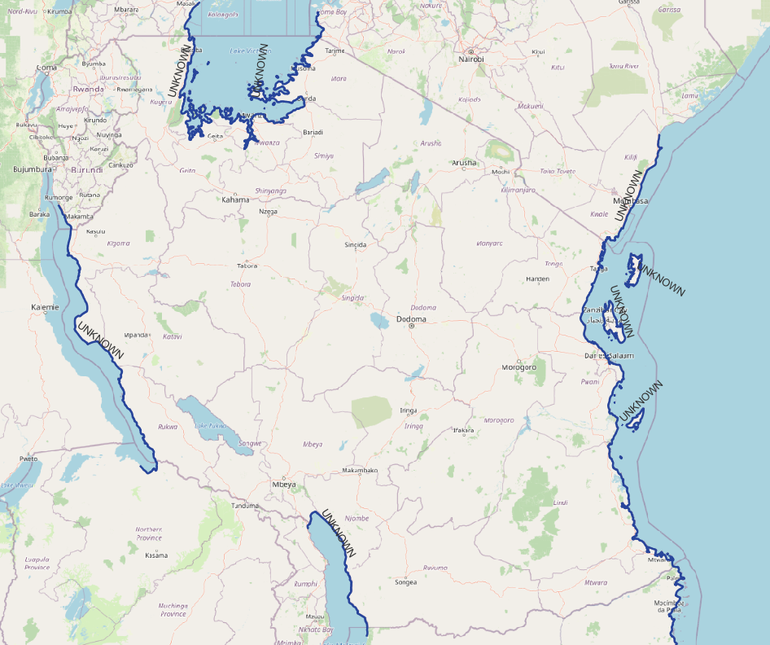
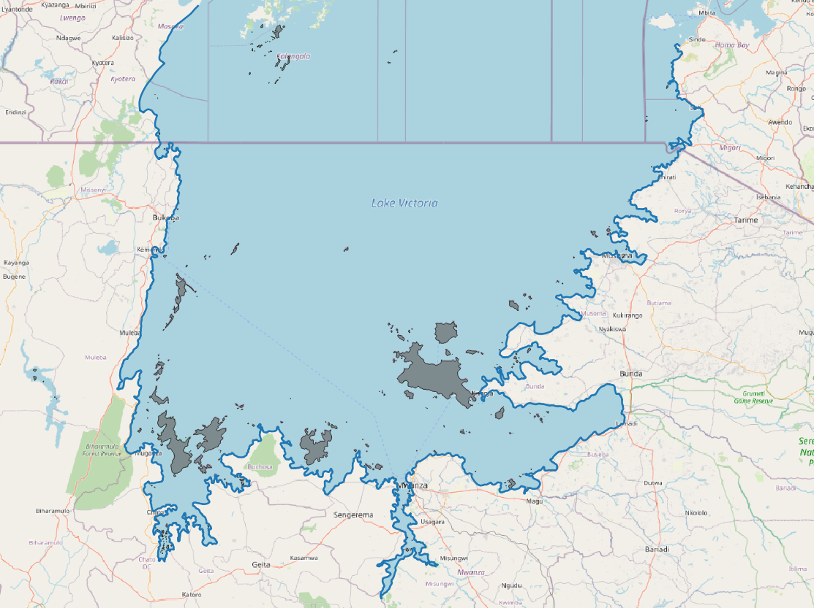
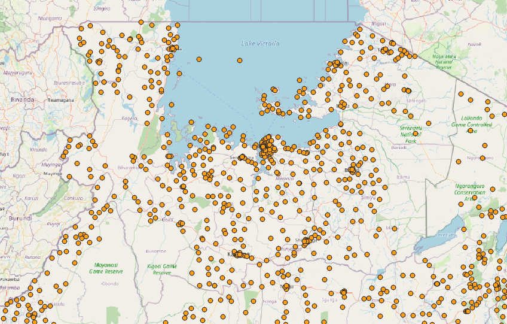
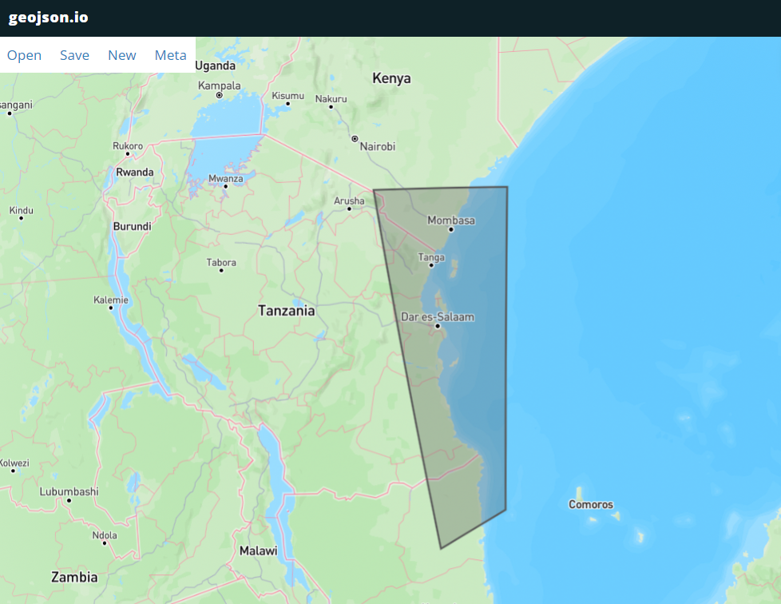
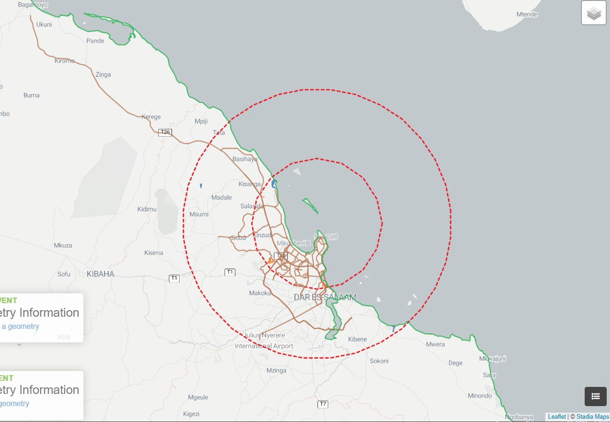
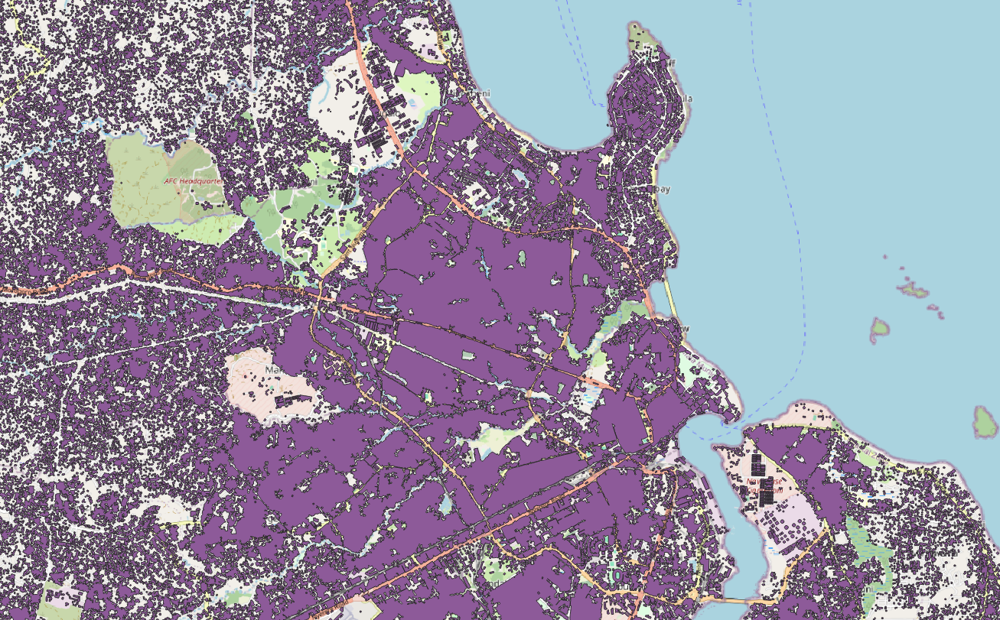

# 81068 Africa 14 countries GIS landusage
<!-- ## Add 14 countries' information into program -->

<!-- - `./resource/config.yaml`
    - find relation
        - link: https://nominatim.openstreetmap.org/ui/search.html
        - 
        -  -->
<!-- 
    ``` python
    Tanzania:
        mcc: "640"
        relation: "195270"
    Uganda:
        mcc: "641"
        relation: "192796"
    Nigeria:
        mcc: "621"
        relation: "192787"
    etc...
    ``` -->
<!--     
- `./src/attributes.py`
    ``` python
    Tanzania = country_config.get("Tanzania").get("mcc"), country_config.get("Tanzania").get("relation")    
    Uganda = country_config.get("Uganda").get("mcc"), country_config.get("Uganda").get("relation")    
    Nigeria = country_config.get("Nigeria").get("mcc"), country_config.get("Nigeria").get("relation")    
    etc...
    ``` -->
## TZ (Tanzania)
### NT2_GEO_POLYGON_Tanzania_81068
<!-- - note : osm_offline_parser.py different Hofn type should be execute seperately -->
<!-- - **1 water, 2 coast line, 7 highway, 11 village** -->
- 1 water
    <!-- - command: `python osm_offline_parser.py ./data/input/tanzania-latest.osm.pbf 640 '1'` -->
    - filter:  `area_threshold` 40000 (m^2), `area_perimeter_ratio_threshold` 0.35 
- 2 coastline
    - filter: <4000 (m)
    - result
        |all coastlines|lake in the country boundry
        |---|---|
        |||
    - pin NT into map for to choose necessary coastlines
        
    <!-- - draw an area manually in https://geojson.io/#map=2/0/20
        - locate .geojson in path: `./data/output/Tanzania/limit_polygon/custom`
        - name as: `limit_polygon.geojson`
        - 
        -  -->
    <!-- 1. coastline -->
    <!-- - download whole Africa data `africa-lastest.osm.pbf` -->
    <!-- - command: `python osm_offline_parser.py ./data/input/{}.osm.pbf 640 2 -locli` -->
    <!-- 2. 3 areas at lack in the country boundry
            
        - command: `python osm_offline_parser.py ./data/input/tanzania-latest.osm.osm.pbf 640 1 -relation 2606941 -locli`
            - `./data/output/Tanzania/water/custom/raw_processed/water_relation_[2606941].tsv`
            - `./data/output/Tanzania/water/custom/raw_processed/island.tsv` -->
    <!-- 3. merge all data -->
- 7 highway
    <!-- - command: `python osm_offline_parser.py ./data/input/tanzania-latest.osm.pbf 640 '7'` -->
- 11 village
    <!-- - command: `python osm_offline_parser.py ./data/input/tanzania-latest.osm.pbf 640 '11'` -->

- **merge all data**
    <!-- - `python geo_polygon_generator.py 640 '1 2 7 11'` -->

- **Validation**
    - Hofn map
        <!-- -  -->
        
    <!-- - run `hofn.py`
    - **Input files 1:**  
        - **Path to put files 1:** `/home/covmo/test_ian/Hofn_v39/data/newzealand/input`
        - `NT2_GEO_POLYGON.tsv`  
        - `NT2_ANTENNA_{tech}.csv`  
        - `NT2_CELL_{tech}.csv`  
        - `NT2_NBR_VORONOI_LOC_{tech}.csv`   -->

    <!-- - **Input files 2:** `config.ini`
        - **Path to put files 2:** `/home/covmo/test_ian/Hofn_v39`
        - reminder: remember to modify `config.ini` -->

    <!-- - **command**: `python Hofn.py ./data/tanzania/input/ ./data/tanzania/output/` -->

    <!-- - **output files**:
        - `NT2_CELL_POLYGON_{tech}.tsv`  
        - `HOFN_CELL_INFO_{tech}.csv`   -->

    <!-- - **Put files into hofn_map**
        - **Path:** `/home/covmo/data/hofn_map`
        - **files**
            - `NT2_GEO_POLYGON.tsv`  
            - `NT2_CELL_POLYGON_{tech}.tsv`  
            - `HOFN_CELL_INFO_{tech}.csv`   -->
    
<!-- 5. **FINISH**
    - write `log` in Hofn wiki
    - write `readme.txt` in `\\INTERNAL1\Project3\CovMo\Module\Geolocation\Landusage_Hofn\Project_base_OSM_data\`
    - reply ticket: provide screenshot in ticket -->

### PU_building_Tanzania_81068
<!-- - building data source: OVERTURE MAPS (https://github.com/OvertureMaps/overturemaps-py) -->

- **result**
    - 
- **rules**
    1. filter buildings < 100 m^2
    2. buffer 10 meter
    3. merge overlap buildings
    4. fill in holes < 10000 m^2
    - `30650235 buildings` filter and merge into `963176 buildings`

- **data analysis**
    - raw buildings area interval
        ```
                        Count  Percentage
        area_interval                      
        0-25 m²        12231271   39.905968
        25-50 m²       10203346   33.289623
        50-100 m²       5367343   17.511591
        100-150 m²      1494281    4.875268
        150-200 m²       683308    2.229373
        200-250 m²       311780    1.017219
        >250 m²          358901    1.170957
        ```
    - holes after buffer and merge
        ```               Count  Percentage
        0-10 m²        55866   35.690283
        10-50 m²       34327   21.929981
        50-100 m²      16131   10.305373
        100-200 m²     15239    9.735514
        200-500 m²     16411   10.484252
        500-1000 m²     8623    5.508848
        1000-1500 m²    3327    2.125471
        1500-2000 m²    1796    1.147384
        2000-10000 m²   4159    2.656999
        >10000 m²        651    0.415895
        ```