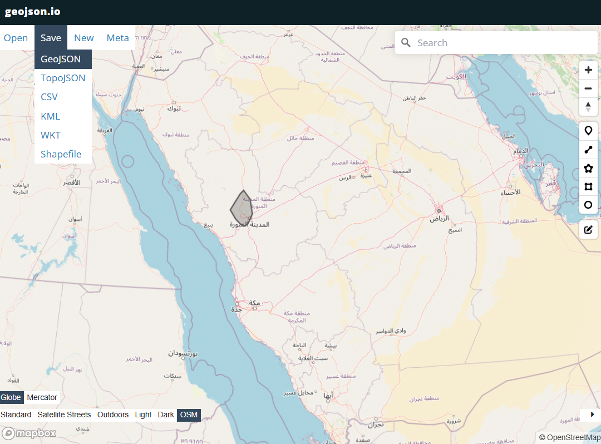
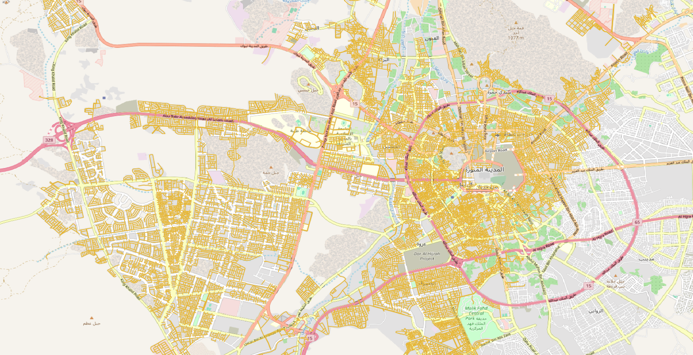
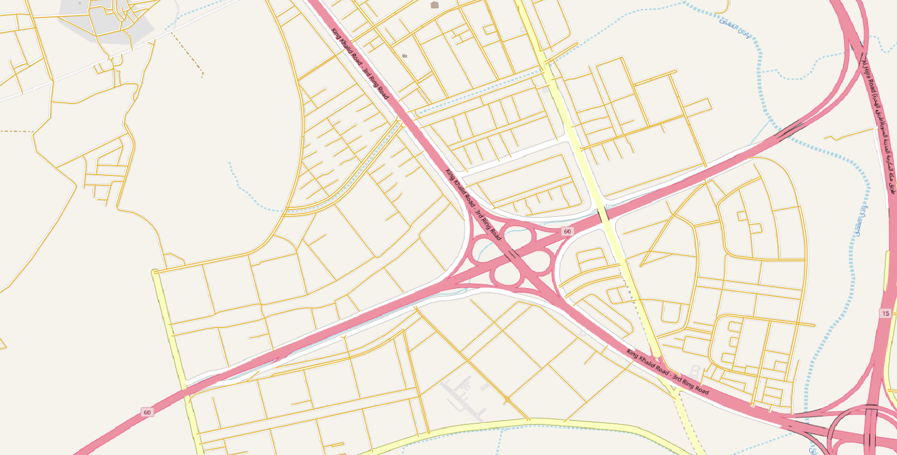
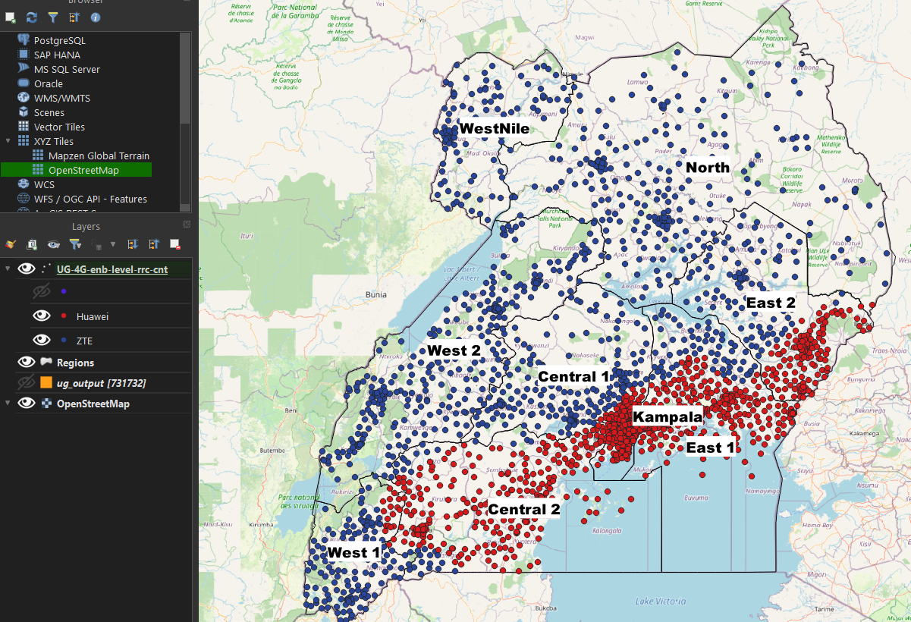
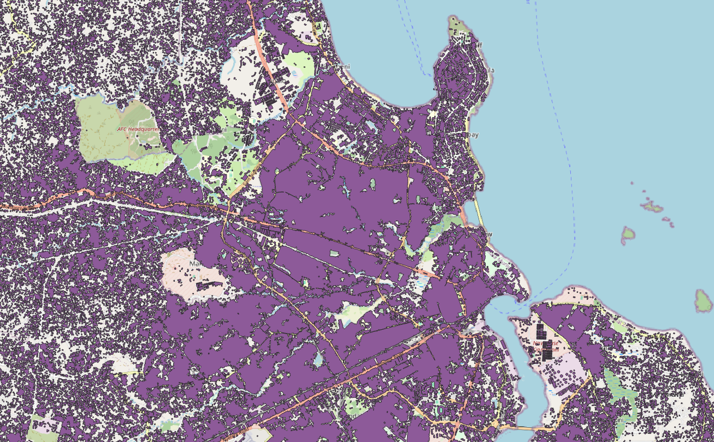

# 1. 82154 stc-vdt provide roads with road_level-7 in the polygon pu73118 osm_offline_parser locli
1. draw a handmade polygon by WKT provied by PM and put in right directory.
    - 

2. output: 
    | overview | zoom in |
    |------|-----|
    | ||

# 2. 82109 [Africa-Uganda] count rrc total for 'ZTE' and 'Huawei'
- provide total RRC for 'ZTE' and 'Huawei' in different region:

    **Huawei**
    | **Vendor** | **Region** | **Total RRC** |
    |-----|------|------|
    | Huawei | East 1 | 407,766,588 |
    | Huawei | East 2 | 100,156,171 |
    | Huawei | Central 1 | 498,981,566 |
    | Huawei | Central 2 | 319,297,450 |
    | Huawei | North | 97,614 |
    | Huawei | West 1 | 9,847,672 |
    | Huawei | Kampala | 1,082,208,881 |
    | Huawei | WestNile | 0 |
    | Huawei | West 2 | 0 |

    **ZTE**
    | **Vendor** | **Region** | **Total RRC** |
    |------|-----|------|
    | ZTE | East 1 | 14,180,948 |
    | ZTE | East 2 | 18,968,266 |
    | ZTE | Central 1 | 80,040,219 |
    | ZTE | Central 2 | 8,095,005 |
    | ZTE | North | 29,470,466 |
    | ZTE | WestNile | 15,232,893 |
    | ZTE | West 1 | 44,474,154 |
    | ZTE | West 2 | 78,559,083 |
    | ZTE | Kampala | 0 |

    

# 81068 Africa polygon-based all_buildings for 12 countries
1. UG (Uganda)
2. KE (Kenya)
3. ZM (Zambia)
4. CD (Democratic Republic of Congo)
5. CG (Republic of Congo)
6. GA (Gabon)
7. MG (Madagascar)
8. MW (Malawi)
9. NE (Niger)
10. RW (Rwanda)
11. SC (Seychelles and dependencies)
12. TD (Chad) 
- 
    