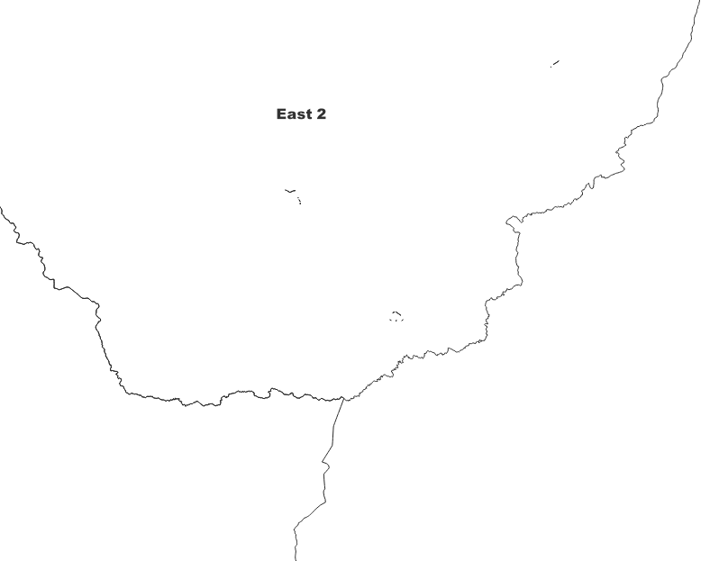
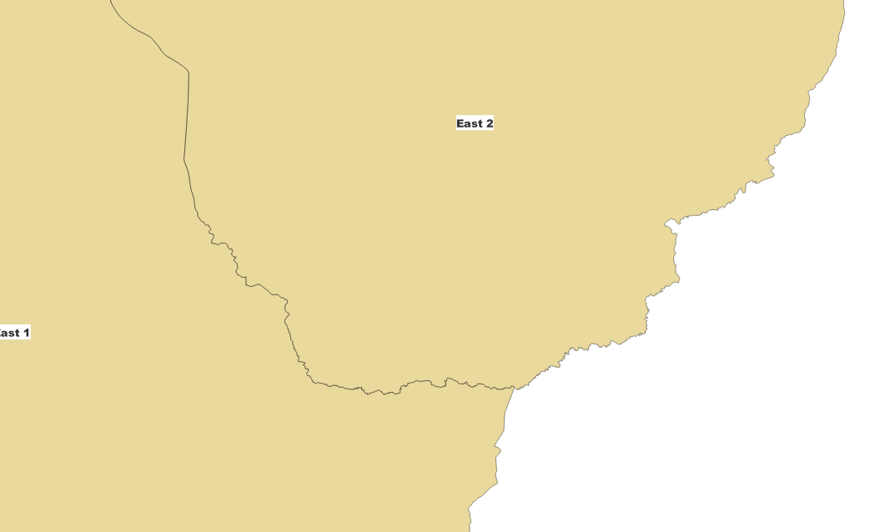
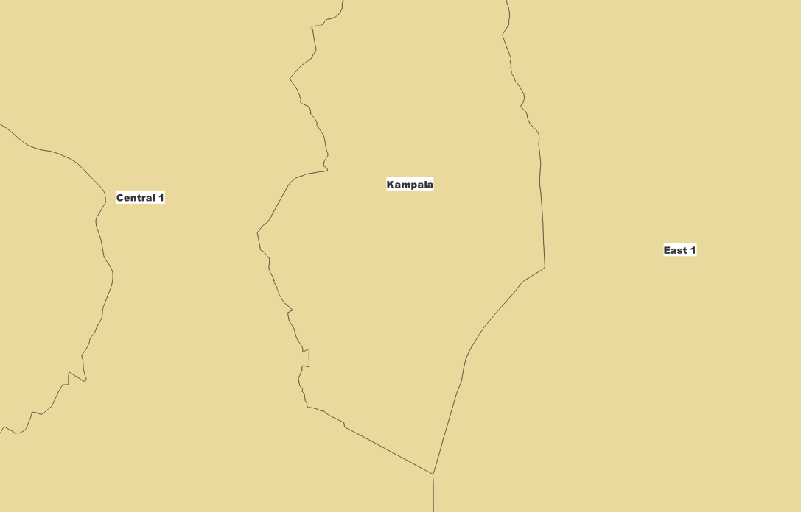
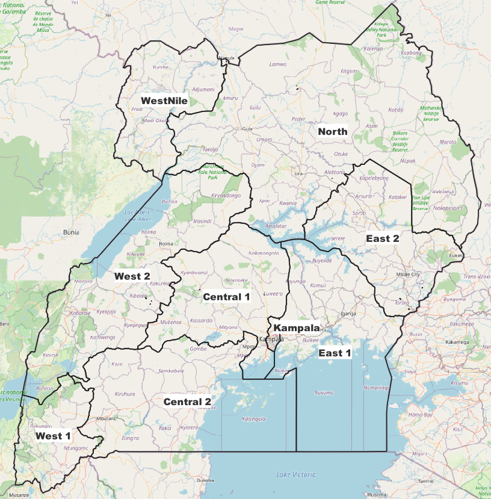
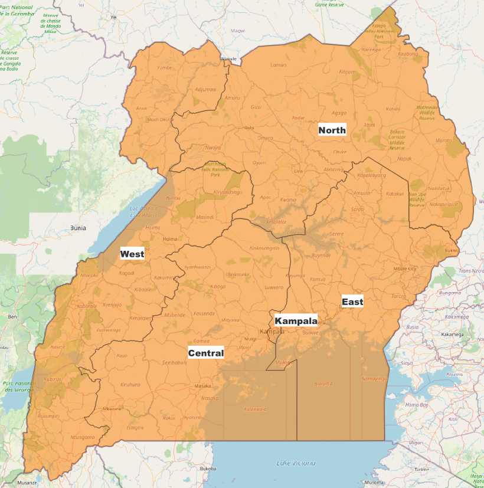
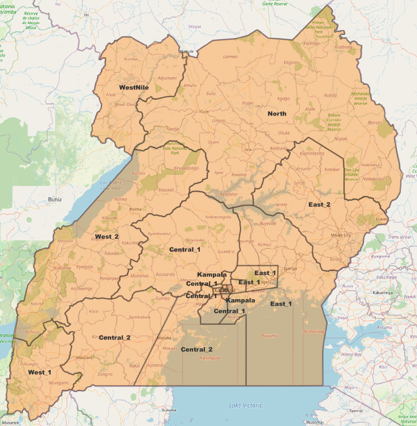
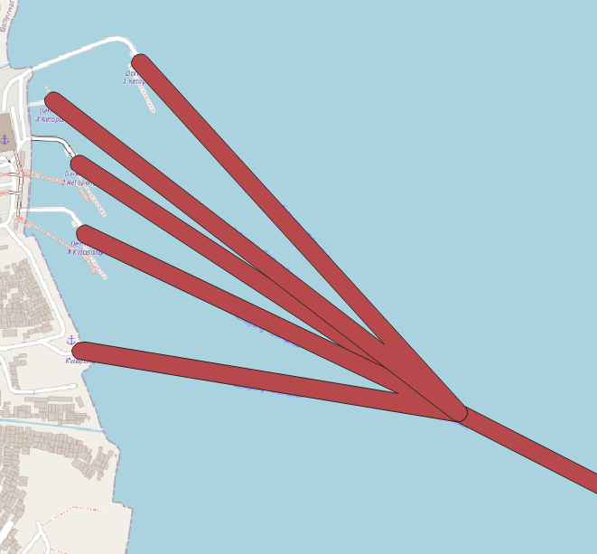
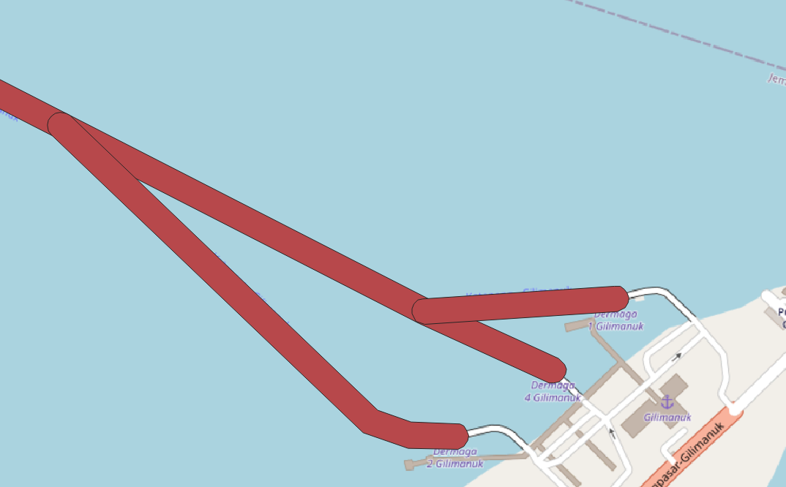
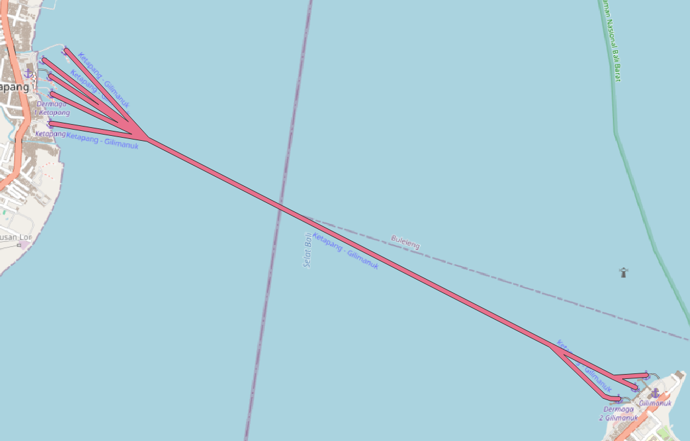

# 82109 Uganda PU_rule
1. provide total RRC for 'ZTE' and 'Huawei' in different region:

    - 

2. source data prepropocess: Eliminate all gaps between regions and fix any incorrect regions boundry and clean some not necessery polygon.
    ||clean unnecessary polygon|fix region boundry|
    |-----|-----|-----|
    |before|||
    |after| ||

3. append new data

4. validation

|Before|After-ZTE|After-Huawei|
|-----|-----|-----|
| | | 

# 82139 Telkomsel add Ferry Route into NT2_GEO_POLYGON
1. ferry route name `Ketapang - Gilimanuk` have 5 rows initally, merge into one route
    |original-1|original-2|merged|
    |------|-----|-----|
    ||||
2. merge old and new `NT2_GEO_POLYGON.tsv` file

## PU_building for 12 countries
### 1. UG (Uganda) 2. KE (Kenya) 3. ZM (Zambia) 4. CD (Democratic Republic of Congo) 5. CG (Republic of Congo) 6. GA (Gabon) 7. MG (Madagascar) 8. MW (Malawi) 9. NE (Niger) 10. RW (Rwanda) 11. SC (Seychelles and dependencies) 12. TD (Chad)
- write a program which can continuously process 12 files 
