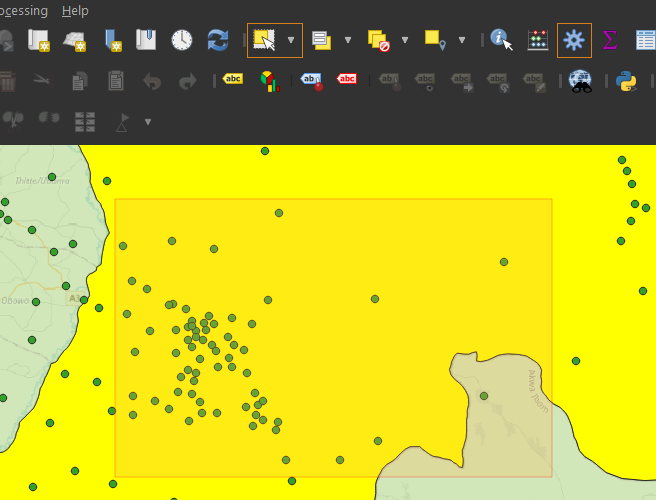

# QGIS
# 調整geomatric    
- 因tsv無法編輯，用這個方法變成暫存檔
    - 
- 用節點工具編輯向外拉
    - 

# 刪除geomatry
1. TSV無法編輯，存成暫存檔
    - 
2. 選取geomatry
    - 
3. open `attribute table`, click `trash can` to delete
    - 

# Steps to Save Selected Geometries as a New Layer:
1. Select the Geometries:
    - Use the selection tools (e.g., Select Features by Rectangle or Select Features by Expression) to choose the geometries you want to save.
2. Right-click on the Layer:
    - In the Layers panel, right-click the layer from which you have selected the geometries.
3. Export the Selected Features:
    - Choose Export > Save Selected Features As... from the context menu.
4. Set the Output Format:
    - In the dialog that appears, set the format you want to export (e.g., ESRI Shapefile, GeoPackage, etc.).
    - Choose a file name and location where you want to save the new layer.
5. Ensure "Selected Features Only" is Checked:
    - In the Export dialog, make sure the Selected Features Only option is checked, so only the selected geometries are saved.
6. Save:
    - Click OK to save the selected geometries as a new layer.

# 計算統計資料ex: sum
1. 右鍵選擇 `Processing Toolbox Panal`
    - 
2. 在panal中選 `basic statistics for fields`
    - 
3. `select features` 選範圍
    - 
4. `run` and find statisticsin it
    - 

# 切割圖形
o	取出其中一個要切的PU
o	Select feature(s)   -> split feature(s)  
o	若想重切 merge selected features  
o	取消選擇feature:  

# 表格新增欄位
- 