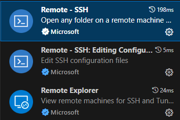
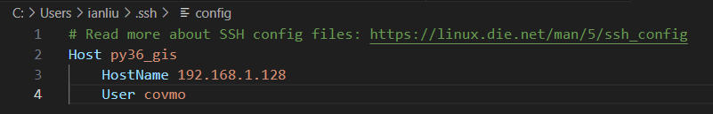

# remote ssh
1. install extension in vscode
    - install remote ssh, it will also install other two extension
    - 

2. Set Up SSH Configuration
    - Open the Command Palette by pressing `Ctrl + Shift + P` and type `Remote-SSH: Open Configuration File`.
    - Select the SSH configuration file to edit (usually ~/.ssh/config).
    - 
3. Connect to the Remote Server
    - Open the Command Palette again (`Ctrl + Shift + P`) and type `Remote-SSH: Connect to Host`.
    - Select the my_remote_server entry (or whatever name you used).
    - VS Code will connect to the remote server and open a new window.
    - 
4. Select Miniconda Python Environment
    - After connecting to the remote server, press `Ctrl + Shift + P` again and search for `Python: Select Interpreter`.