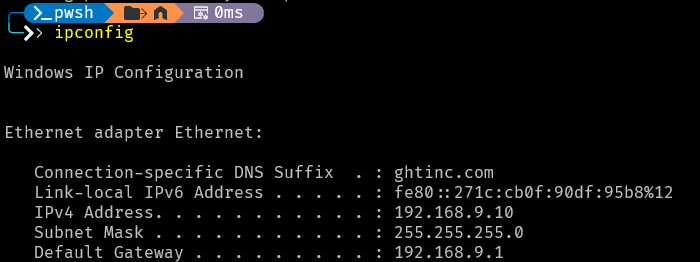
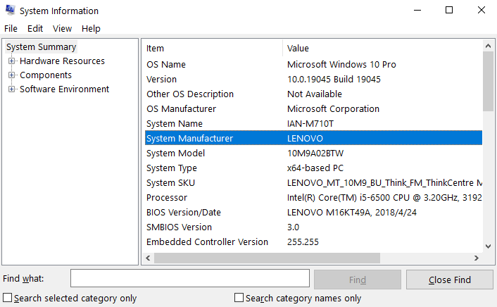
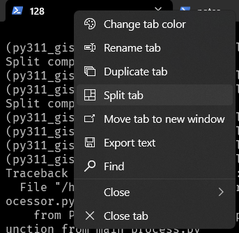
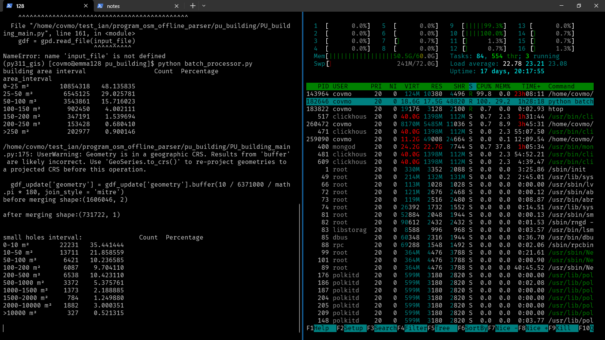

## search ip
- `ipconfig`
    - 

## Microsoft-Windows-Subsystem-Linux
0. `以管理員身分執行`開啟終端機
1. 安裝 WSL:`wsl --install`
2. 啟用 WSL：`dism.exe /online /enable-feature /featurename:Microsoft-Windows-Subsystem-Linux /all /norestart`
3. 啟用虛擬機平台（這是 WSL 2 所需的功能）：`dism.exe /online /enable-feature /featurename:VirtualMachinePlatform /all /norestart`
4. 安装 WSL 发行版：`wsl --install -d Ubuntu`
4. 查看電腦品牌: 
    - 按下 Win + R，输入 msinfo32，然后按回车打开 系统信息 窗口。
    - 在系统信息窗口中，找到 系统制造商（System Manufacturer） 和 系统型号（System Model）。这将显示你的电脑品牌和型号。
    - 
5. 無法使用，要在 Lenovo 电脑上启用虚拟化支持（Intel VT-x 或 AMD-V），请按照以下步骤操作：
    - 重启电脑：
        - 完全关机或重启你的 Lenovo 电脑。
    - 进入 BIOS 设置：
        - 在启动时，反复按下 F2 或 Delete 键（不同型号可能会有所不同，如果 F2 无效，可以尝试 Esc 或 F10）。
        - 继续按下这些键，直到看到 BIOS 设置界面。
    - 找到虚拟化选项：
        - 在 BIOS 菜单中，使用键盘上的方向键导航到“Configuration”或“Advanced”选项卡。
        - 找到“Intel Virtualization Technology”或“AMD-V”选项。
    - 启用虚拟化：
        - 将“Intel Virtualization Technology”或“AMD-V”设置为 Enabled。
        - 如果你找不到该选项，请检查主板型号是否支持虚拟化。
    - 保存更改并退出：
        - 按 F10 保存并退出 BIOS 设置。
        - 选择“Yes”确认更改。
    - 重新启动电脑：
        - 电脑会重新启动，虚拟化支持应该已启用。
        - 启用虚拟化后，你可以尝试再次安装和运行 WSL。

### 帳號密碼
- 帳號: `ianliu`
- password: same as computer login passward

## terminal
### split windows
- Right-click on the PowerShell icon in the taskbar and select `split tab`.
    - 
    - 