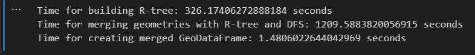

- [工作紀錄](#工作紀錄)
    - [20241028](#20241028)

## 工作紀錄
### 8.1.2024
- 簽署入職文件、介紹環境
- 課程：Emma介紹CovMo 101
- 電腦設置
  - putty
  - WinSCP
  - Dbeaver
  - Git
  - miniconda
  - VS code
  - Python3.6 [https://ithelp.ithome.com.tw/articles/10210071](https://ithelp.ithome.com.tw/articles/10210071)

### 8.2.2024
- 課程：Emma介紹NT
- 課程：Shoeldn GIS
  - 內容：landusage, Hofn
  - 作業：GIS介紹PPT下周二下午報告
- 上網搜尋GIS相關內容 & 做GIS介紹PPT

### 8.5.2024
- 學習GIS相關內容
  - vector data / raster data / data format
  - coordinate systems (CRS) / European Petroleum Survey Group (EPSG)
  - Well-Known Text (WKT): 描述幾何形狀 / CRS
- 做GIS介紹PPT
- 學習NT parser, NT Hilo概念
- 備註：
  - 衛生紙在咖啡機上面的櫃子
  - 重點先看NT, GIS的部分

### 8.6.2024
- (早) 理清GIS不同元件之間的關係/ 做GIS介紹PPT
- (午) 課程：GIS - Sheldon
  - 報告上次GIS intro作業，統整GIS基礎概念
  - 講解本次作業：熟悉shapely/geopandas套件、程式作業(taiwan)、熟悉overpass query
  - 講解GIS file資料清理流程、OSM, Geofabrik、QGIS軟體
- (午) 簽署青年就業計畫文件 - Pauline
- (午) 看作業

### 8.7.2024
- 安裝python
- Python Venv
- 下載、學習使用GQIS
- Joy Shelden GIS交接會議
  - [OSM Offline Parser](https://node82.ghtinc.com/research/gis_module/osm_offline_parser)
- 做HW2

### 週報 8.7.2024
- Two GIS learning section with Shelden
  - HW1_GIS intro PPT / learn GIS basic concept
  - HW2_GIS program implement：Python packages, venv(miniconda), implement
- GIS Handover meeting：OSM Offline Parser
- Learn CovMo & NT basic concept
- Computer setup (e.g. download applications, python, environment)
- Plan
  - HW2_GIS program implement
  - Familiarize with Shapely/GeoPandas and Overpass Query

### 8.8.2024
- 下載miniconda
- 做HW2
  - [geopandas.overlay()](https://geopandas.org/en/stable/docs/reference/api/geopandas.overlay.html)
  - [Geopandas Gallery Overlays](https://geopandas.org/en/stable/gallery/overlays.html)
- 備註
  - VS Code：
    - 若記憶體容量不足pylance會crash
    - 記得開auto save
    - Todo tree：可以顯示TODO內容，好用的extension
  - 每周周會分享投影片儲存地點：\\internal1\temp\Research_Team\Topic

### 每周一確認網頁是否有上線
- 筆記：[HackMD](https://hackmd.io/PDIeUXR4SIWkVLEUlhI9HQ)
- 一定要開：
  - flat
  - noma 123(covmo), noma 128(covmo)
  - jupyter notebook
  - readme_book(module_note)
- 利用linux scerrm/tmux手動開啟時要先換到正確的port
  - Flat：192.168.3.152
  - 其他的port在flat網頁上，游標移到左下角即可看到
  - [CSDN lsof command tutorial](https://blog.csdn.net/qq_42006613/article/details/109433609)
- 查PID：lsof
- 關掉網頁：kill

### GIS HW2-兩layer算出相交面積&個數
- `geopandas.GeoDataFrame.to_crs`
- `pandas.DataFrame.apply`
  - 如何使用 pandas 的 apply？Dataframe 加入新 Column？Python 數據整合處理！
- `pandas.Series`
- 問題
  - Self_grid開頭沒有寫參考坐標系要如何辨別
- 計算面積方式
  - Pyproj：[Calculating Area in km² for Polygon](https://gis.stackexchange.com/questions/127607/calculating-area-in-km%c2%b2-for-polygon-in-wkt-using-python/375598#375598)

### 8.9.2024
- 做GIS HW2 程式有跑出來，剩下area
- Opt交接會議
- GIS training session

### 連線到公司server
- 先從putty連到server
- 接著從terminal中開啟下指令：
  - `ssh covmo@{IP}` (ex: ssh covmo@192.168.1.128)

### 試跑OSM_offline_Parser (GIS HW3)
- 跑程式的步驟：
  1. 到[Geofabrik](https://download.geofabrik.de/)下載所需地區的.pbf檔
  2. 執行指令：`python osm_offline_parser.py ./data/input/malaysia-singapore-brunei-latest.osm.pbf 525 1`
  3. 產出water.tsv 檔 
      - 路徑：/home/covmo/test_Ian/osm_offline_parser/data/output/Singapore/water/['536780']/post_processed/water.tsv
  4. 手動將post_processed底下的water.tsv檔案移動到/home/covmo/test_Ian/osm_offline_parser/data/output/Singapore/water底下
  5. 執行指令：`python geo_polygon_generator.py 525 1`
  6. 產出NT2_GEO_POLYGON.tsv & NT2_GEO_POLYGON.csv
      - 路徑：/home/covmo/test_Ian/osm_offline_parser/data/output/Singapore/NT2_GEO_POLYGON.tsv
      - 路徑：/home/covmo/test_Ian/osm_offline_parser/data/output/Singapore/NT2_GEO_POLYGON.csv

### 在192.168.1.128這個server上面跑
- 自己建虛擬環境
- Gitlab：[https://node82.ghtinc.com/research/gis_module/osm_offline_parser#call-commands](https://node82.ghtinc.com/research/gis_module/osm_offline_parser#call-commands)
- 直接把gitlab上所有程式抓下來就可以使用
- Data source：[https://download.geofabrik.de/](https://download.geofabrik.de/)
- Hofn type
  - Hofn_type是一個公司自訂的代號，不同的type會直接匯應到檔名
  - Hofn_type 對照：[http://192.168.3.152:8021/module/hofn/frs.html](http://192.168.3.152:8021/module/hofn/frs.html)

### -t tags
- -t tags 是對應到OSM上面的tag, 實際上是根據這個來抓的
  - [Overpass query Code](https://redmine.ghtinc.com/projects/chtcovms/wiki/Landusage)
- 若沒下-t指令的話，會在config內直接有對應的
- 最下面有python dependency 在server上可以自己建一個虛擬環境，這些package一定要有

Error: osmium: /home/covmo/miniconda3/lib/libstdc++.so.6: version `GLIBCXX_3.4.30' not found (required by osmium)
- [參考文章](https://blog.csdn.net/qq_40861800/article/details/128432884)
- Venv/gis 原始設定：
  - `cd covmo/miniconda3/envs/py36_gis/lib/`
  - `ls -l | grep libstdc++.so.6`
  
- 解決流程：
  1. 檢查環境是否有 GLIBCXX_3.4.30
     - `strings /home/covmo/miniconda3/envs/py36_OSMOfflineParser/lib/libstdc++.so.6.0.30 | grep GLIBCXX`
  2. 檢查環境中哪裡有 `libstdc++.so.6.0.30`
     - `locate libstdc++.so.6`
  3. 將找到的文件複製到自己的環境
     - `cp /home/covmo/miniconda3/envs/gis/lib/libstdc++.so.6.0.30 /home/covmo/miniconda3/envs/py36_OSMOfflineParser/lib/`
  4. 創建新的連結
     - `ln -sf /home/covmo/miniconda3/envs/py36_OSMOfflineParser/lib/libstdc++.so.6.0.30 /home/covmo/miniconda3/envs/py36_OSMOfflineParser/lib/libstdc++.so.6`

---

## OSM 使用
- [Overpass Turbo](https://overpass-turbo.eu/index.html)
  - Filter by area
  - [Get all data within a named area](https://dev.overpass-api.de/overpass-doc/en/full_data/area.html)
- [OSM Main Site](https://www.openstreetmap.org/#map=8/23.611/120.768)
- [查詢 tags](https://wiki.openstreetmap.org/wiki/Zh-hant:Map_Features#%E5%A4%A7%E7%9C%BE%E9%81%8B%E8%BC%B8(Public_Transport))

---

## Miniconda/Git 使用
- Miniconda 下載和環境設置：
  - [Python 安裝教學](https://medium.com/@hmchang/%E7%B5%A6%E5%88%9D%E5%AD%B8%E8%80%85%E7%9A%84-python-%E5%AE%89%E8%A3%9D%E6%95%99%E5%AD%B8-578bf0de9cf8)
  - 環境變數設定： Setting up Miniconda for Beginner Data Scientists
  - 虛擬環境位置：`\\Users\\ianliu\\.conda\\envs\\venv0`
  - 套件安裝：`shapely, geopandas`
  - [使用說明](https://medium.com/@hmchang/%E7%B5%A6%E5%88%9D%E5%AD%B8%E8%80%85%E7%9A%84-python-%E5%AE%89%E8%A3%9D%E6%95%99%E5%AD%B8-578bf0de9cf8)
  
- 套件安裝方式：
  - Conda install
  - Pip install
    - 建議首先使用 `conda install`
  
- Installation Channel：
  - `conda-forge`
    - 指令範例：
      - `conda install -c conda-forge osmium-tool==1.14.0`
      - `conda install -c pip pyyaml`
      - `-c` 表示 channel
  
- 在 Server 128 中：
  - `source /home/covmo/miniconda3/bin/activate`
  - `conda activate py36_OSMOfflineParser`
  
---

## Git 使用
- 要下載 gitlab 上的項目，需要設置 ssh key 並連接到 gitlab
- 從本地下載 gitlab 資料指令：
  - `git clone`
  - 範例： `git clone git@node82.ghtinc.com:research/gis_module/osm_offline_parser.git`

---

## TSV to CSV 程式
- 在 128 server 執行以下指令：
  - `sh /home/covmo/convert_tsv_to_csv.sh {目標檔案}`
  - 範例：
    - `sh /home/covmo/convert_tsv_to_csv.sh /home/covmo/test_Ian/osm_offline_parser/data/output/Singapore/water/[‘536780’]/post_processed/water.tsv /home/covmo/water.csv`

---

## QGIS 使用
1. 新增 tsv 檔案
2. 新增全球圖資
3. 顯示屬性資料
4. 根據數字顯示不同顏色
5. 選取圖徵顯示資料
6. 測量兩點間距離

---

## GIS Training 0814
- GIS 部門業務：
  1. Landusage
  2. Hofn
  3. 3D building
  4. PU building（indoor/outdoor 判斷）
  5. VDT（PU highway）：客戶會拿手機繞路，藉助 PU highway 跑出行徑路線
  6. dim_mcc：每個國家的國界 polygon
  7. PU_rule：將每個國家 site 分割，由不同 server 處理
  8. Dim_region：區域結構圖（例如台北、新北、台北下的中山區、松山區等）

---

## Weekly Report 08.14.2024
1. GIS Training：
   - 出席 2 次 GIS Training。
2. 計算交集區域及縣市數量。
3. 執行 OSM_offline_parser（設置虛擬環境）。
4. 學習 Overpass 語法。
5. 學習使用 QGIS。

- Plan：
  - 使用不同 Hofn type 測試 OSM_offline_parser。

---

## GIS Training Homework
- 使用 osm_offline_parser 完成以下任務：
  - 台灣海岸線切斷（範例）
  - 摩納哥延伸海岸（自訂 polygon 的方式）
  
### 重啟 Internal Service
- `screen -ls`
  - `screen -S {name}` 建立新 screen
  - `screen -r {ID}` 重新連接
  - `Ctrl + a + d` 將 screen 保持在背景執行

---

## Hofn Map - NT2_GEO_POLYGON 資料顯示
- 網頁地址：`http://192.168.1.128:8055/`
- 必要檔案位置：`/home/covmo/data/hofn_map/`

## Sharing 文件位置
- `\\internal1\temp\Research_Team\Topic\Technical`

---

## Weekly Report 08.21.2024
1. **#79755**：
   - 產生瑞士建築數據。
2. **日本 OSM_offline_parser 執行**：
   - 使用 Hofn_type 包括：
     - Water, Coastline, Highway, Railway
3. **程式碼檢閱**：
   - osm_offline_parser：主要針對 line string mode
4. **Training 出席**
   
- Plan：
  - 了解 OSM_offline_parser 中的 Hofn_type。
  - 執行 Hofn.py。
  - 熟悉 Overpass 語法。
## 08.22.2024
- 跑Hofn.py完成
- 看osm_offline_parser line code
- 學習如何修改module note

## 08.23.2024
- 看overpass 語法
  - 用relation框範圍 36+[0] +relation id共十位數
- VSCode快捷鍵: https://wyatthoho.medium.com/visual-studio-code-%E5%B8%B8%E7%94%A8%E7%9A%84%E5%BF%AB%E6%8D%B7%E9%8D%B5-894ff940a2c1

#80319澎湖加上道路圖資
- why
  - 遠傳原本都沒有用道路圖資
  - 澎湖有幾個跨海大橋，上面無法定位，所以澎湖道路圖資要加上
  - 可以用程式讀進原本的圖資，看原始有哪些hofn type 包含在裡面
  - 每個cell分為stationary & moving 
  - 若只加上跨海大橋那三段的圖資，所有在移動中的設備可能都會被定位到跨海大橋，所以要加上全澎湖的道路圖資
- procedure
  - 使用osm_offline_parser 規定澎湖區域，抓road level 1-5 (1 2 3 應該是沒有資料)
  - 加進原本的圖資裡面
    - 原始圖資: (最新版) \\INTERNAL1\Project3\CovMo\Module\Geolocation\Landusage_Hofn\Project_base_OSM_data\FET\20231023
- 實作步驟
  - `python osm_offline_parser.py ./data/input/taiwan-latest.osm.pbf 466 7 --limit_relation_ids 3339738`
  - `python geo_polygon_generator.py 466 '7'`
  - merge 新舊tsv檔: 
    - `merge_tsv.py` 檔案 位置(server128)/home/covmo/test_Ian/tools
    - 指令: `python merge_tsv.py file1.tsv file2.tsv`

### GIS training
- Homework
  - Osm_offline_parser
    - (OK)海岸線切斷-以台灣為例
    - (OK)海岸線延伸-以摩納哥為例(用limit polygon 的方式畫出延伸大於摩納哥的區塊，抓出海岸線)(limit polygon 可以用軟體畫出經緯度，參考sheldon sharing ppt)
  - 3D building 後處理
    - 要注意: 樓高太高不合理
    - 多邊形有重疊或是側面有連結要設為同一個building id
- Training 內容
  - 不同hofn type 處理
    - 1 water: 湖、水壩等等，要用外圈減內圈，內圈目前是小島
    - 2 coastline: 有些國家在做的時候會故意畫得比較長，避免定位點從沒畫的海岸線附近跳出去ex: 摩納哥
    - 3 underground MRT: 只做地下的部分，因為地上的捷運我們其實分不出來是在公路上還是在捷運上，會盡量先把所有way接起來，接著以station為斷點切開這些way。因為在某個捷運站的基地台服務區域通常只會畫到下一個捷運站之前。
    - 5 island:以前離島也是用5，但現在離島是用coastline，剩下湖中央的小島用5，但之後可能會淘汰
    - 6 tunnel: 通常在隧道裡的基地台就是服務隧道的，但瑞士特別，瑞士隧道的基地台都是放在歲到外面往內打，因此比較難分辨。
    - 7 highway:　先分不同level，再合併
    - 9 indoor building
    - 10 ship road/ ferry: 會多給一個區域是航線範圍，因此是polygon而不是linestring
    - 11 village: 如果是荒郊野外的小鎮，要特別注意，通常會把在山裡的其他定位點拉到小鎮
    - 13 forest/ field
    - 14 railway: 
    - 15 funicular
  - Hofn map顯示NT2_GEO_POLYGON資料
    - 網頁http://192.168.1.128:8055/
    - Server 128儲存位置: ll /home/covmo/data/hofn_map/
    - 必要檔案
      - HOFN_CELL_INFO_LTE.csv
      - NT2_ANTENNA_LTE.csv
      - NT2_CELL_POLYGON_LTE.tsv
      - NT2_GEO_POLYGON.tsv
    - Searching area 
      - 大圈: 抓海岸線跟水域資料(如果真的連到很遠的地方，要訂邊界保證不會定位到怪位置)
      - 小圈: 抓到路等其他資料

## 08.26.2024
- 重啟internal service
- 紀錄上周五課程筆記
- 海岸線切斷-以台灣為例
  1. `python osm_offline_parser.py ./data/input/taiwan-latest.osm.pbf 466 2`
  2. search taiwan main island relation id using QGIS
  - 
  3. `python osm_offline_parser.py ./data/input/taiwan-latest.osm.pbf 466 2 -d 9406157`
  4. generated file's path & name: `./data/output/Taiwan/coastline/['449220']/post_processed/post_processed_9406157.tsv`
- 摩納哥延伸海岸
  - input:
    - `provence-alpes-cote-d-azur-latest.osm.pbf`
  - output:
    - 
  1. draw a handmade polygon
    - [link](https://geojson.io/#new&map=2/0/20)
    - output: map.geojson
    - 
  2. put in right directory
    - locate .geojson in path: `./data/output/Monaco/limit_polygon/custom`
    - name as: `limit_polygon.geojson`
  3. add Monaco's information into `config.yaml & attributes.py`
    ```python
    # attributes.py line 85
    Monaco = country_config.get("Monaco").get("mcc"), country_config.get("Monaco").get("relation")    
    ```
    ```yaml
    # config.yaml line 129
    Monaco:
      mcc: "212"
      relation: "1124039"
    ```    
  4. execute program using command `python osm_offline_parser.py ./data/input/provence-alpes-cote-d-azur-latest.osm.pbf 212 2 -locli`
  5. output 
    - path: `./data/output/Monaco/coastline/custom/post_processed`
    - file name: `coastline.tsv`

回單
- 在放資料那邊要加一個 readme.txt 詳細記錄這次做了甚麼 
  - 一定要有本次單號
  - 一定要有上次資訊
- 在redmine update log 那邊要加上本次log

週會Sharing檔案放置位置
- \\internal1\temp\Research_Team\Topic\Technical

## 08.27.2024
- 週會sharing簡報
- Swizerland building data cleaning 
  - data pre processing
    - split all situation into fout catagarize
      - height | level
        1. y        y
        2. y        nan(包含於1)
        3. nan      y
        4. nan      nan(不處理)
    - 1, 2 一起處理
    - 3: 將level * 3做為height
    - 4: 不處理
    - deal with not reasonable height(situation 1 & 2)
      - print out all height > 200
      - check manullaly
      - 
      - 
    - input relation_ids to fix height
    - fill in 'height' == Nan by 'level' * 3

## 08.28.2024
- 看Switzerland building merge 怎麼做
  - https://pygeos.readthedocs.io/en/latest/predicates.html
    - intersects(a, b, **kwargs)
    - Returns True if A and B share any portion of space.
    - Intersects implies that overlaps, touches and within are True.

Gis training
- 3D building 
  - 要給.tsv 及 .geojson

Gis training
• 3D building 
  o 要給.tsv 及 .geojson兩個檔案
  o 參考資料 #55155
  
• 講課
  o 切斷海岸線做完以後要做一次hofn 丟到hofn map(http://192.168.1.128:8055/)跑看看是否可用(驗證)
  

## Weekly report 08.28.2024
1. #80319  Add the roads data for the Penghu area to the existing NT2_GEO_POLYGON file for FET
2. Run hofn.py.
3. OSM_offline_parser: Taiwan coastline divide, Monaco coastline extend.
4. Understand how Hofn_type 2, 7, and 14 work in OSM_offline_parser.
5. Switzerland building data cleaning.

Plan
o Merge intersecting buildings in Switzerland.

## 08.29.2024
• 收尾sharing in meeting PPT 並上傳
• Merge building: assign building id, calculate max height

## 08.30.2024
• 本地端建新venv py3.11(待測試)
• Merge building

Airflow: http://192.168.1.9:5570/admin/airflow/graph?dag_id=NT_DP_CovMo

Training
• 有新案子要去問單號多少，要新增config推到gitlab上
• https://redmine.ghtinc.com/projects/chtcovms/wiki/Hofn
  o ship_route_line : if true, Hofn will support LineString data type for ship route (from v34).如果有航線資料的話，geo_polygon跟hofn的資料要一樣(線或是面)
• 資料流程: http://192.168.1.9:5570/admin/airflow/graph?dag_id=NT_DP_CovMo
  (除錯)若有定位在不正確的地方流程

Hofn在線上的位置
 
 
## 09.02.2024
• Merge building 提升效能

## 09.03.2024
• 跑馬爾地夫航線 看buffer部分在哪裡 如何使用
• 重跑一次merge building
  o 看時間複雜度
  o building id 會有缺的值ok嗎(OK)

Training
Road融合customer & osm 
building前處理減少筆數 All_building.tsv 
Dim_mcc 國家邊界 

## 09.04.2024
• merge building improve efficiency

#80645 add info to NT2_GEO_POLYGON - ferry route Maldives

Added the ferry route to the NT2_GEO_POLYGON file.  
The file now includes Hofn_type 1, 2, 7 (levels 1~6), and 10.  
Ferry road width is 100m.  

procedure: 
1. run osm_offline_parser  
   prepared file:  
   path: /home/covmo/test_ian/osm_offline_parser/data/input  
   file name: maldives-latest.osm.pbf  
   output file:  
   path: /home/covmo/test_ian/osm_offline_parser/data/output/Maldives  
   file name:  
   NT2_GEO_POLYGON.csv  
   NT2_GEO_POLYGON.tsv  

   path: /home/covmo/test_ian/osm_offline_parser  
   command:  
   1. python osm_offline_parser.py ./data/input/maldives-latest.osm.pbf 472 10  
      manully move ferry.tsv  
      from  
      /home/covmo/test_ian/osm_offline_parser/data/output/Maldives/ferry/['536773']/post_processed  
      to  
      /home/covmo/test_ian/osm_offline_parser/data/output/Maldives/ferry  
   2. python geo_polygon_generator.py 472 '10'  

2. merge old & new GEO_POLYGON file  
   path: /home/covmo/test_ian/tools/merge_two_tsv  
   command: python merge_tsv.py ./data/NT2_GEO_POLYGON_old.tsv ./data/NT2_GEO_POLYGON_new.tsv  

3. run hofn.py  

   3.1 prepared files:  
   3.1.1  
   sorce data: /opt/covmo/parser/nt/nt_ready/  
   path: /home/covmo/test_ian/Hofn_v39/data/maldives/input  
   input files:   
   NT2_GEO_POLYGON.tsv          
   NT2_ANTENNA_GSM.csv  
   NT2_ANTENNA_UMTS.csv     
   NT2_CELL_LTE.csv   
   NT2_NBR_VORONOI_LOC_LTE.csv  
   NT2_ANTENNA_LTE.csv  
   NT2_CELL_GSM.csv      
   NT2_CELL_UMTS.csv  
   NT2_NBR_VORONOI_LOC_GSM.csv  
   NT2_NBR_VORONOI_LOC_UMTS.csv  

   3.1.2  
   sorce data: https://node82.ghtinc.com/configurations/hofn_configurations/blob/master/41.Maldives.config.ini  
   path: /home/covmo/test_ian/Hofn_v39  
   input file:  
   config.ini  
   reminder: remember to modify GEO_POLYGON input path & log output path  

   3.2 run hofn.py  
   path: /home/covmo/test_ian/Hofn_v39  
   command: python Hofn.py ./data/maldives/input/ ./data/maldives/output/  

4. validation  

4.1 put files into hofn_map  

   path: /home/covmo/data/hofn_map  
   files:  
   NT2_GEO_POLYGON.tsv         
   HOFN_CELL_INFO_GSM.csv    
   NT2_CELL_POLYGON_LTE.tsv   
   HOFN_CELL_INFO_LTE.csv    
   NT2_CELL_POLYGON_UMTS.tsv  
   HOFN_CELL_INFO_UMTS.csv   
   NT2_CELL_POLYGON_GSM.tsv  

4.2 open hofn map to check  

5. reply ticket & add log in Hofn wiki  

## Weekly report 09042024
• #80645 - Include ferry routes for the Maldives.  
• Create a merge building program.  
• Attend two GIS training sessions.  

## 09052024
• 把Maldives NT2_GEO_POLYGON資料放到128 backup  
• 改merge building input output argument  
• 畫mcc邊界*6  

## 09062024
• 畫mcc  
• 寫Geojson_to_tsv.py  

## 09092024
• 完成dim_mcc  #80743  
  o 畫mcc邊界 Seychelles 633  
  o 畫完減去小數點 存成tsv  

Gis training - PU
o 切PU #80806 - Split huge traffic Ericsson PUs to v3 servers  
  • (STC : 沙烏地阿拉伯，裡面有不同的電信商(vendor)這次要做的是Ericsson的PU要改變)  
  • PM會三個資料:  NT2_ANTENNA_LTE, NT2_CELL_LTE, Ericsson traffic  
    o File path: \\Internal1\Project3\Projects\STC\80806  
  • 自己要找以前的pu_rule:  
    o File path: \\INTERNAL1\Project3\CovMo\Module\Project_PU_Polygon\STC\v41  
    o 搜尋步驟:  
    o redmine右上角搜尋CovMo STC(本次地區)  
    o 左邊搜尋PU_rule  
    o 找有Ericsson的案子  

• STC_Ericsson_rehomeplan  
  o 三個欄位分別為PU_id, cell_id, RRC  
• PU_rule  
  o 本檔案丟到QGIS  
  o 將圖案設為半透明，加入OSM底圖  
  o 取出其中一個要切的PU  
  o Select feature(s)   -> split feature(s)  
  o 若想重切 merge selected features  
  o 取消選擇feature:  

• NT2_ANTENNA_LTE, NT2_CELL_LTE, Ericsson traffic  
  o 此三個檔案可以將每個cell的longititude 以及latitude算出來，加到Ericsson traffic欄位後面  
  o Antenna才有long let，要對到cell，再丟到Ericsson traffic  

## 09102024
- 切PU

## 09112024
- 切PU
  - 完成前半段程式部分

### Weekly report
- #80743 - Modify country boundary for dim_mcc
- #80806 - Split huge traffic Ericsson PUs to v3 servers
- GIS training – PU
- New comers training * 2
- Plan
  - #80806 – Merge the modified file with the original file.

## 09122024
- #80806 – 切STC Ericsson 的PU
  - 改polygon_name 
  - polygon_string要縮短到六位數
  - sheldon的檔案要再加進原始檔案

## 09132024
- 回單 放到V42自己建一個
- 寫作業流程readme
- New commer training CovMo

## 09162024
- 完成split PU
  - 重命名程式
- 檢查dim mcc gitlab 645 646 650 並回單

## 09182024
- 回dim_mcc單
- 做new Zealand單 #79379
  - 1. Road 1-5
  - 2. Water (lake, coastline)
- 新人內訓

### Weekly report 09182024
- #80743 [Airtel]- Create/modify country boundary for dim_mcc
- #80806 [STC] - Split Ericsson Pus & reorder polygon_name 
- #79379 [degrees] - Generate the NT2_GEO_POLYGON for New Zealand with hofn_type 1, 2 and 7
- #81019[Telkomsel] – Research how to handle new data
- Two newcomer training sessions: 3GPP & DB structure
- Plan
  - #79379 2degrees - generate the initial version of NT2_GEO_POLYGON for New Zealand with hofn_type 1,2,7

## 09192024
- 2degrees 
  - merge NT2_geo_polygon table
  - 研究PU_building
- Telkomsel
  - 研究 3D_building

## 09202024
- 紐西蘭PU_buliding

## 09232024
- 紐西蘭PU_buliding

## 09242024
- 紐西蘭pu_building 
  - filter
  - Buffer
  - Merge

### GIS Training
- 週報
  - Html檔案不要用絕對路徑
  - 寄信改用直接把資料貼到信件中
- 紐西蘭
  - 紐西蘭海岸線要篩選+切
  - 紐西蘭PU_building填補的空隙設大一些ex 10000m^2
- 在128建虛擬環境，安裝jupyter套件，用tmux等方法執行jupyter，可以在自己的瀏覽器開啟使用

## 20240925
- 2 degrees紐西蘭PU building完成
- 做telkomsel 3D_building

### Weekly report20240925
- #79379 - [2degrees] PU building
- #81019 - [Telkomsel] Append new 3D building
- Plan
  - #81019 - [Telkomsel] Append new 3D building
  - #79379 - [2degrees] Generate the NT2_GEO_POLYGON

## 20240926
- Telkomsel 3d_building
  - 要篩掉20m以下的建築物
  - 產出三個檔案

## 20240927

## 20240930
- Telkomsel 3D_buildong
  - Valid
  - Check 是否有Muitipolygon
  - AGL = 0 刪掉

## 20241001
- 2degree(Newzealand) – coastline
  - Filter length < 30000(meter, 30Km)
  - Cut coastline

## 20241002
- 2degree (New Zealand) – coastline
  - Cut coastline – 找更改切得的程式碼位置

## 20241004
- 紐西蘭海岸線有很多跨海橋，要把海岸線向外拉，使用qgis
- 因tsv無法編輯，用這個方法變成暫存檔
- 用節點工具編輯向外拉
- 完成後要檢查validation(自己跟自己) & intersection(自己跟別人)

## 20241007
- 完成紐西蘭NT2_GEO_POLYTON

## 20241008
- 將vscode連到遠端server的python環境
- Geo polygon 完成後要再wiki加上Project Status
- 14非洲國家先做坦尚尼亞&奈及利亞

## 20241009
- 坦尚尼亞geo polygon
  - 海岸線其他國家的小島部分要刪除

## 20241014
- 坦尚尼亞geo polygon完成

### Weekly report 20241016
- #79379 [2degrees]
  - Create polygon-based all_buildings
  - Create NT2_GEO_POLYGON 
- #81068[Airtel Africa]
  - Create NT2_GEO_POLYGON and polygon-based all_buildings for Tanzania 

### Plan
- (ongoing) #81068[Airtail Africa]
  - Create new pu_rule for Nigeria
- #81068[Airtel Africa]
  - Create NT2_GEO_POLYGON and polygon-based all_buildings for remaining 13 countries

## 20241016
- 如何反向寫入qgis 檔案
- 2calculate_total_rrc.py寫註解

## Weekly report 20241023
- #81651 - [Airtel Africa] Create PU_rule for Nigeria.
- Topic sharing – research merge building algorithm for PU_building

- **PLAN**
- #81068 - [Airtel Africa] Create NT2_GEO_POLYGON and polygon-based all_buildings for Africa 13 countries.

### 20241024
- Topic sharing, 自評 & 互評
  - 完成Topic sharing: [PU_building] efficient spatial merging algorithm 
  - 完成本季self review & review_research (自評&互評)

### 20241028
- 計算uganda total RRC (for PU_rule)
- 跑 `polygon_based_all_buildings` 12個國家
    - `batch_process.py`一次執行多個檔案
- `NT2_GEO_POLYGON`, `uganda` 
    - create `run_osm_offline_parser.py`
    - run command
        ```python
        commands = [
        ["python", "osm_offline_parser.py", "./data/input/uganda-latest.osm.pbf", "641", "1"],
        ["python", "osm_offline_parser.py", "./data/input/uganda-latest.osm.pbf", "641", "2"],
        ["python", "osm_offline_parser.py", "./data/input/uganda-latest.osm.pbf", "641", "7"],
        ["python", "osm_offline_parser.py", "./data/input/uganda-latest.osm.pbf", "641", "11"]
        ]
        ```

### 20241029
- #82109 [Africa-Uganda] count rrc total for 'ZTE' and 'Huawei'
- #82154 [STC-VDT] create highway.tsv contains roads with road_level-7 in the polygon you provide previously(PU73118).
    - Teach Luthfi how to use QGIS for selecting multiple road segments at once and exporting as GeoJSON, which will facilitate further GIS processing.
- #81068 [Africa] polygon-based all_buildings for 12 countries (except Tanzania and Nigeria)
- Plan
  - #82109 [Africa-Uganda] Create PU-rule
  - #81068 [Africa] polygon-based all_buildings for Nigeria & NT2_GEO_POLYGON
 
### weekly report 20241030
- **#82109** count rrc total 
- **#82154** [STC-VDT] create highway.tsv contains roads with road_level-7 in the polygon you provide previously(PU73118).
    - 教luthfi如何使用QGIS一次選擇多段馬路，輸出為geojson，也方便gis後續處理

### 20241030
- **#82109** 清理客戶給的 Uganda Region 資料，包括將兩個區域的region切下一小斷，合併成新的
  - 
  - 

  - 
  - 
  
- **#82109** 完成ZTE PU_rule
- **#81068** 上傳12個國家的 polygon_based_all_building.tsv
    1. UG (Uganda)
    2. KE (Kenya)
    3. ZM (Zambia)
    4. CD (Democratic Republic of Congo)
    5. CG (Republic of Congo)
    6. GA (Gabon)
    7. MG (Madagascar)
    8. MW (Malawi)
    9. NE (Niger)
    10. RW (Rwanda)
    11. SC (Seychelles and dependencies)
    12. TD (Chad)


### TODO
- 寫測驗題(已完成3待寫6)
  - 已完成
    - 113/9/10、9/11 RF Introduction(Trainer：Alex Chang) 
    - 113/9/13 CovMo Presentation & Demo、Fundamentals of Mobile Network & Geolocation (Trainer：Jasmine)
    - 113/9/18  3GPP Events Overview (Trainer：Allen) 